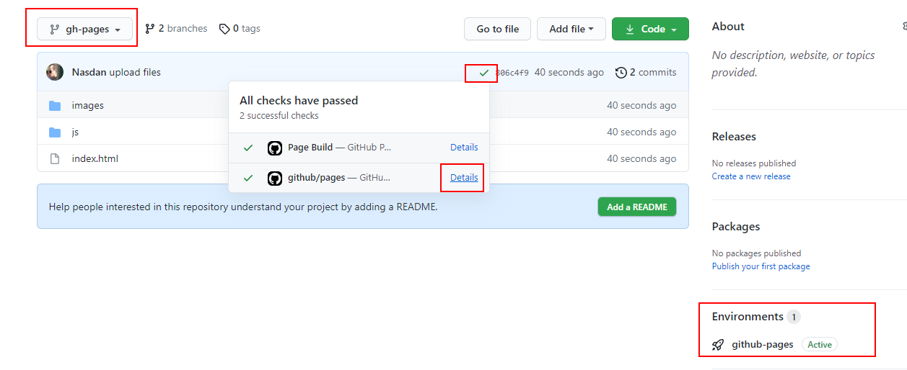

# 03 Github branch

In this example we are going to create a production server using Github pages.

We will start from `02-azure-ftp`.

# Steps to build it

`npm install` to install previous sample packages:

```bash
npm install
```

Using previous application, we upload it using [Github Pages](https://pages.github.com/). We only need to create a new `Public` repository.

> NOTE: In this case we won't use `express server` to serve front app, because Github Pages has its own server.

Upload files:

```bash
git init
git remote add origin git@github.com...
git add .
git commit -m "initial commit"
git push -u origin main
```

Run build command:

```bash
npm run build
```

Create a new branch called `gh-pages`.

Remove all files except `dist` folder. And move `dist` folder's files to root path. We should have on root path:

```
|--assets/
|--index.html

```

Upload files:

```bash
git add .
git commit -m "upload files"
git push -u origin gh-pages
```

Now, we have deployed our website in: `https://<user-name>.github.io/<repository-name>`:



> NOTE: We can change branch name on Settings tab > GitHub Pages section

As we see, we have some errors when retrieving files:

_https://<user-name>.github.io/assets/index-a824b72f.js net::ERR_ABORTED 404_

This issue is related with the references to assets in the `index.html` file. We need to change the references to:

```diff
<!DOCTYPE html>

<html lang="en">
  <head>
    <meta charset="utf-8" />
    <title>Cloud Module</title>

    <meta name="viewport" content="width=device-width, initial-scale=1" />
-   <script type="module" crossorigin src="/assets/index-a824b72f.js"></script>
-   <link rel="modulepreload" crossorigin href="/assets/vendor-13e230a0.js">
+   <script type="module" crossorigin src="./assets/index-a824b72f.js"></script>
+   <link rel="modulepreload" crossorigin href="./assets/vendor-13e230a0.js">
  </head>
  <body>
    <div id="root"></div>

  </body>
</html>
```

> Due to Github Pages uses a subpath for the project, we need to add `./` to the references.

Instead of doing manually, we will change the bunlder config. Checkout to main branch

```bash
git checkout main

```

Update config:

_./vite.config.js_

```diff
import { defineConfig, splitVendorChunkPlugin } from 'vite';
import react from '@vitejs/plugin-react';
import path from 'path';

export default defineConfig({
+ base: './',
  envPrefix: 'PUBLIC_',
  ...
```

> [Vite Public base path](https://vitejs.dev/guide/build.html#public-base-path)

Run build command:

```bash
npm install

npm run build

```

Copy `dist` folder to `gh-pages` branch as above.

Commit and push:

```bash
git add .
git commit -m "upload files with base path"
git push

```

# About Basefactor + Lemoncode

We are an innovating team of Javascript experts, passionate about turning your ideas into robust products.

[Basefactor, consultancy by Lemoncode](http://www.basefactor.com) provides consultancy and coaching services.

[Lemoncode](http://lemoncode.net/services/en/#en-home) provides training services.

For the LATAM/Spanish audience we are running an Online Front End Master degree, more info: http://lemoncode.net/master-frontend
