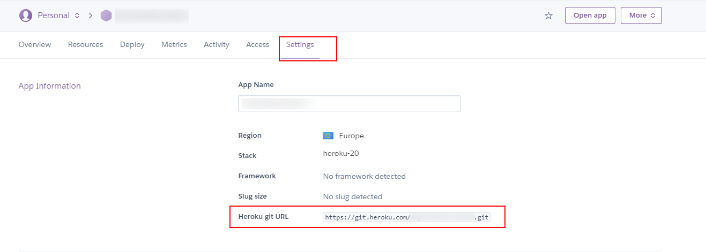

# 04 Heroku branch

In this example we are going to create a production server using Heroku.

We will start from `03-github-branch`.

# Steps to build it

- `npm install` to install previous sample packages:

```bash
npm install
```

- Create `heroku app`:


- We need to use an [Heroku buildpack](https://elements.heroku.com/buildpacks). It's a tool to build processes for your preferred language or framework. Right now, we can use [heroku-buildpack-static](https://elements.heroku.com/buildpacks/heroku/heroku-buildpack-static):


- Use this buildpack in `Settings` tab:

> Buildpack url: https://github.com/heroku/heroku-buildpack-static.git


> Buildpack url https://github.com/heroku/heroku-buildpack-static.git

- We need `git` to clone the Heroku app repository and works on it:



> Check `Deploy` tab for another deploy options.

```bash
npm install -g heroku

heroku login
git clone https://git.heroku.com/<heroku-app-name>.git .
```

> Another ways to install Heroku CLI: [Download heroku cli](https://devcenter.heroku.com/articles/heroku-cli#download-and-install)
> Or using [npx](https://github.com/npm/npx)

- Run build command:

```bash
npm run build
```

- Copy `./dist` files to new repository.

- Add `static.json` file for deploy config:

_./static.json_

```bash
{
  "root": "./"
}

```

- Result:

```
|- images
|- js
|- index.html
|- static.json

```

- Commit and push:

```bash
git add .
git commit -m "add static files"
git push
```

- Open url:


- Sometimes, we need create our custom web server to deploy `static files` and use same server to expose REST API / GraphQL endpoints. We can use [nodejs buildpack](https://elements.heroku.com/buildpacks/heroku/heroku-buildpack-nodejs):

.

- Remove `heroku-buildpack-static`:


- Remove `static.json` file.

- Create `public` folder.

- Move `front files` to public folder.

- Copy from `source code repository` > `./server/index.js`, `./server/package.json` and `./server/package-lock.json` files to `heroku repository`:

- Add `.gitignore` file:

_.gitignore_

```
node_modules

```

- Result:

```
|- public/
|---- images
|---- js
|---- index.html
|- .gitignore
|- index.js
|- package-lock.json
|- package.json

```

- Add a custom REST API endpoint:

_./index.js_

```diff
const express = require('express');
const path = require('path');

const app = express();
const staticFilesPath = path.resolve(__dirname, './public');
app.use('/', express.static(staticFilesPath));

+ app.use("/api/hello", async (req, res) => {
+   res.send("Custom API endpoint");
+ });

const PORT = process.env.PORT || 8081;
app.listen(PORT, () => {
  console.log(`App running on http://localhost:${PORT}`);
});

```

- Deploy it:

```bash
git add .
git commit -m "add nodejs + express server"
git push
```

- Open url:


- Open `https://<heroku-app-name>.herokuapp.com/api/hello`

- If you want to see logs:

```bash
heroku login
heroku logs -a <heroku-app-name>
```

> NOTE: [Download heroku cli](https://devcenter.heroku.com/articles/heroku-cli#download-and-install)
> Use `npm install -g heroku`
> Or using [npx](https://github.com/npm/npx)

# About Basefactor + Lemoncode

We are an innovating team of Javascript experts, passionate about turning your ideas into robust products.

[Basefactor, consultancy by Lemoncode](http://www.basefactor.com) provides consultancy and coaching services.

[Lemoncode](http://lemoncode.net/services/en/#en-home) provides training services.

For the LATAM/Spanish audience we are running an Online Front End Master degree, more info: http://lemoncode.net/master-frontend
