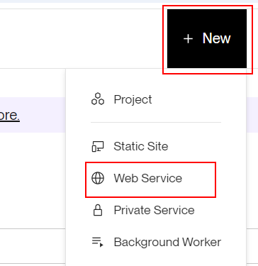
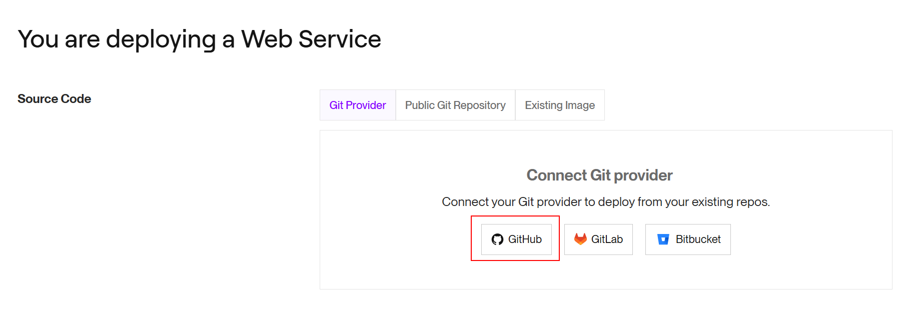
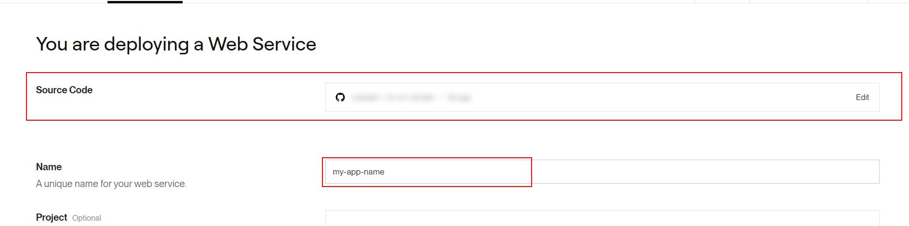
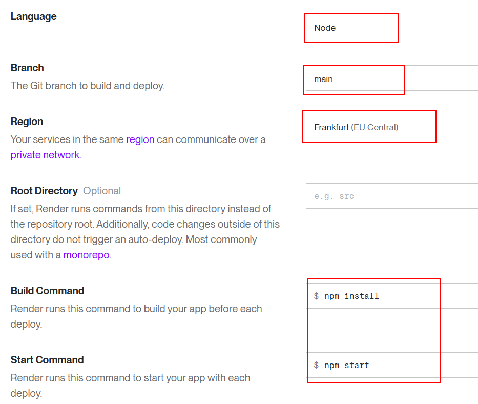

# 04 Manual Render Deploy

In this example we are going to create a production server using Render.

We will start from `03-github-branch`.

# Steps to build it

`npm install` to install previous sample packages:

```bash
npm install
```

[Render](https://render.com/) is a cloud provider that allows you to deploy different types of apps based on git repository changes.

First, we need to prepare the final files that we want to deploy, let's restore the vite configuration:

_./vite.config.js_

```diff
import { defineConfig, splitVendorChunkPlugin } from 'vite';
import react from '@vitejs/plugin-react';
import path from 'path';

export default defineConfig({
- base: './',
  envPrefix: 'PUBLIC_',
  ...

```

Run build:

```bash
npm run build

```

Let's copy the `dist` folder content to `server/public` folder.

_./server_

```
|server/
|-- public/
|----- assets/
|----- index.html
|-- index.js
|-- package-lock.json
|-- package.json
```

Let's create a new empty repository:


Clone repository:

```bash
git clone git@github.com<your-url>.git .

```

> Note: you can use a dot at the end of the command to clone the repository in the current folder.

Let's copy the `server` files into the deploy repository root path.

_Root path of the deploy repository_

```
|-- public/
|----- assets/
|----- index.html
|-- index.js
|-- package-lock.json
|-- package.json

```

Commit and push:

```bash
git add .
git commit -m "initial commit"
git push

```

Create a new render app:





Configure web service:





Clicks on `Create Web Service` button.

After the successful deploy, open `https://<app-name>.onrender.com`.

# About Basefactor + Lemoncode

We are an innovating team of Javascript experts, passionate about turning your ideas into robust products.

[Basefactor, consultancy by Lemoncode](http://www.basefactor.com) provides consultancy and coaching services.

[Lemoncode](http://lemoncode.net/services/en/#en-home) provides training services.

For the LATAM/Spanish audience we are running an Online Front End Master degree, more info: http://lemoncode.net/master-frontend
