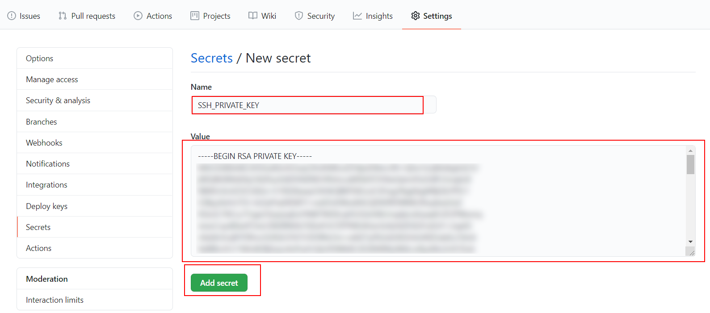

# 02 Github actions

In this example we are going to create a production server using Github pages and Github actions.

We will start from `04-heroku-branch`.

# Steps to build it

- `npm install` to install previous sample packages:

```bash
npm install
```

- We will use same approach as `gh-pages` example, but we will use [Github Actions](https://docs.github.com/en/free-pro-team@latest/actions) for automatic deploys.

- Create new repository and upload files:

```bash
git init
git remote add origin git@github.com...
git add .
git commit -m "initial commit"
git push -u origin main
```

- Install [gh-pages](https://github.com/tschaub/gh-pages) as dev dependency to deploy to Github pages:

```bash
npm install gh-pages --save-dev
```

- Add deploy command:

_./package.json_

```diff
  "scripts": {
    ...
    "test:watch": "npm run test -- --watchAll -i --no-cache",
+   "build:dev": "npm run clean && webpack --config ./config/webpack/dev.js",
+   "deploy": "gh-pages -d dist"
  },
```

- Run dev build and deploy it:

```bash
npm run build:dev
npm run deploy
```

> NOTE: We can run deploy because we have access to repository
> since we are logged in Github

- Add GitHub actions CD workflow:

_./.github/workflows/cd.yml_

```yml
name: Continuos Deployment workflow

on:
  push:
    branches:
      - main

jobs:
  cd:
    runs-on: ubuntu-latest
    steps:
      - name: Checkout repository
        uses: actions/checkout@v3
      - name: Install
        run: npm ci
      - name: Build
        run: npm run build
      - name: Deploy
        run: npm run deploy
```

- Add commit with changes:

```bash
git add .
git commit -m "add continuos deployment"
git push
```

- As we saw, the workflow was failed. Why? Because each time a Github job is executed, it's a new and clean machine outside repository. That is, we need to allow job's git push. The best approach is creating a new ssh key on local:

```bash
ssh-keygen -m PEM -t rsa -C "cd-user@my-app.com"
```
```bash
> Enter file in which to save the key (/c/Users/nasda/.ssh/id_rsa): `./id_rsa`
> Enter passphrase (empty for no passphrase): `Pulse Enter for empty`
> Enter same passphrase again: `Pulse Enter for empty`
```

> NOTES
> -m PEM: Format to apply. PEM is a common public/private key certificate format.
> rsa: RSA is the crypto algorithm.
> Enter `./id_rsa` to save files in currect directory
> You can leave empty the passphrasse field.

- Copy `id_rsa.pub` content to `Github Settings` > `Deploy keys` section:


- Delete `id_rsa.pub` file.

- Copy `id_rsa` content to `Github Settings` > `Secrets` section:




- Delete `id_rsa` file.

- Now, we can use this shh private key to do a commit/push in Github's job:

_./.github/workflows/cd.yml_

```diff
name: Continuos Deployment workflow

on:
  push:
    branches:
      - master

jobs:
  cd:
    runs-on: ubuntu-latest
    steps:
      - name: Checkout repository
        uses: actions/checkout@v3
+     - name: Use SSH key
+       run: |
+         mkdir -p ~/.ssh/
+         echo "${{secrets.SSH_PRIVATE_KEY}}" > ~/.ssh/id_rsa
+         sudo chmod 600 ~/.ssh/id_rsa
+     - name: Git config
+       run: |
+         git config --global user.email "cd-user@my-app.com"
+         git config --global user.name "cd-user"
      - name: Install
        run: npm ci
      - name: Build
        run: npm run build
      - name: Deploy
-       run: npm run deploy
+       run: npm run deploy -- -r git@github.com:<owner>/<repository-name>.git

```

> NOTES:
> "Use SSH key" step: create id_rsa with ssh private key in default ssh folder and add write permits.
>
> "Deploy" step: update deploy command with repository's SSH URL.
>
> [gh-pages -r flag](https://github.com/tschaub/gh-pages#optionsrepo)

```bash
git add .
git commit -m "configure git cd-user permits"
git push
```


# About Basefactor + Lemoncode

We are an innovating team of Javascript experts, passionate about turning your ideas into robust products.

[Basefactor, consultancy by Lemoncode](http://www.basefactor.com) provides consultancy and coaching services.

[Lemoncode](http://lemoncode.net/services/en/#en-home) provides training services.

For the LATAM/Spanish audience we are running an Online Front End Master degree, more info: http://lemoncode.net/master-frontend
