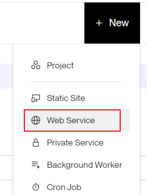
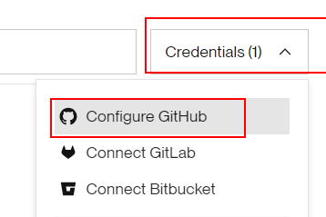
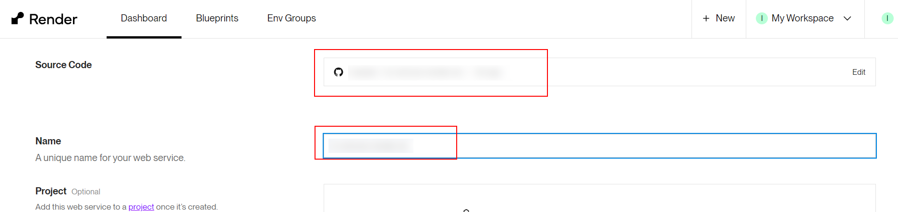
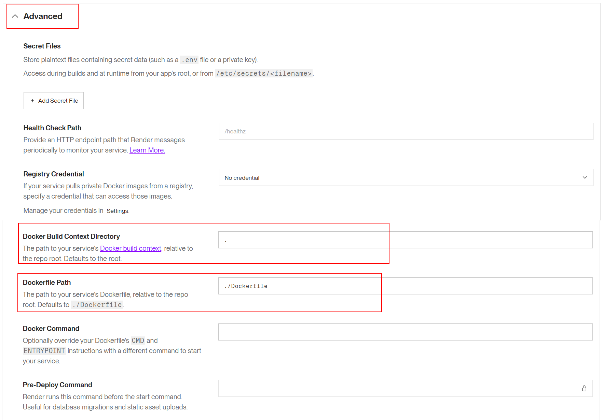

# 04 Auto render deploy

In this example we are going to upload Docker image with a front app to Render.

We will start from `03-upload-docker-image`.

# Steps to build it

`npm install` to install previous sample packages:

```bash
npm install
```

[Render](https://render.com/) is a cloud provider that allows you to deploy different types of apps based on git repository changes.

Create new repository and upload files:


```bash
git init
git remote add origin git@github.com...
git add .
git commit -m "initial commit"
git push -u origin main

```

Create a new _Render_ app:



Configure account to get access to the new repository:



Configure web service:




Update docker settings (Advanced settings):



Clicks on `Create Web Service` button.

After the successful deploy, open `https://<app-name>.onrender.com`.

As you can see, _Render_ does not care about the _PORT_ environment variable in the Dockerfile, it uses the port 10000 by default. We can remove it:

_./Dockerfile_

```diff
...

- ENV PORT=8080
CMD node index.js

```

# About Basefactor + Lemoncode

We are an innovating team of Javascript experts, passionate about turning your ideas into robust products.

[Basefactor, consultancy by Lemoncode](http://www.basefactor.com) provides consultancy and coaching services.

[Lemoncode](http://lemoncode.net/services/en/#en-home) provides training services.

For the LATAM/Spanish audience we are running an Online Front End Master degree, more info: http://lemoncode.net/master-frontend
