# 04 Auto render deploy

In this example we are going to upload Docker image with a front app to Azure.

We will start from `04-auto-render-deploy`.

# Steps to build it

`npm install` to install previous sample packages:

```bash
npm install
```

Create new repository and upload files:


```bash
git init
git remote add origin git@github.com...
git add .
git commit -m "initial commit"
git push -u origin main

```

Create a new Azure app:

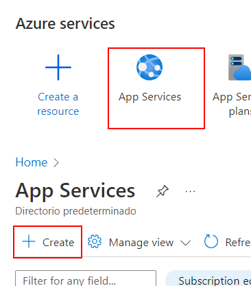

Configure the new app instance details:

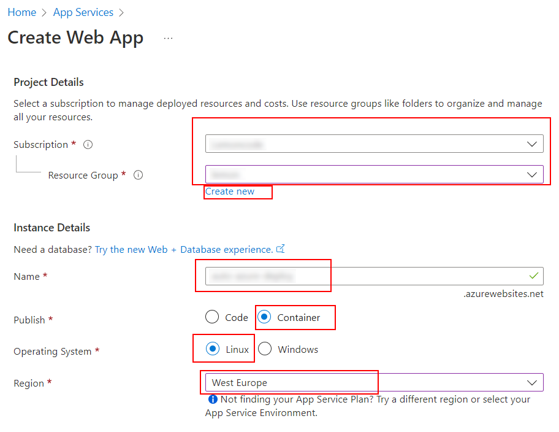

Configure pricing plans:

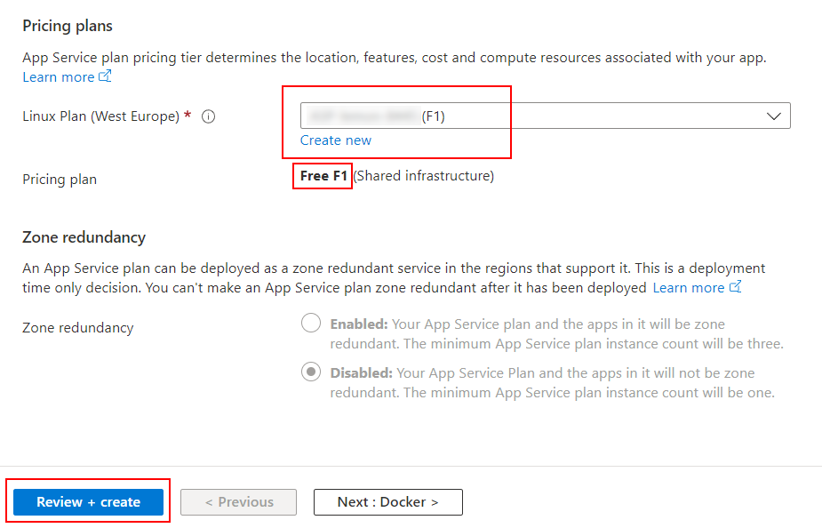

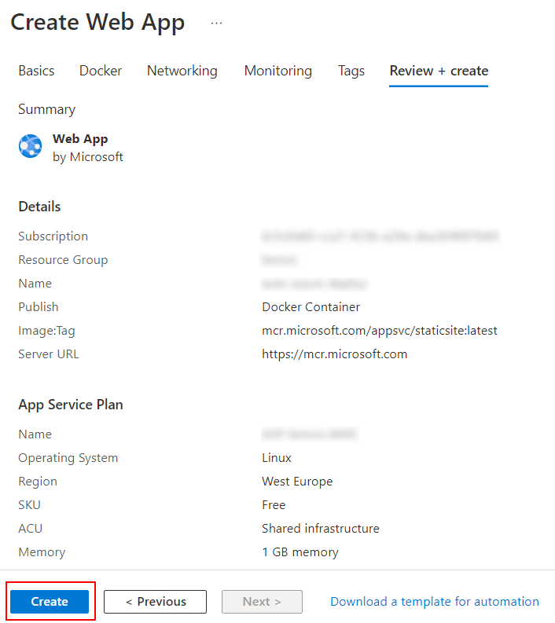

As we can see, this app will deploy an example of Microsoft Docker Image. We can provide our custom Docker image in the configuration section using environment variables:

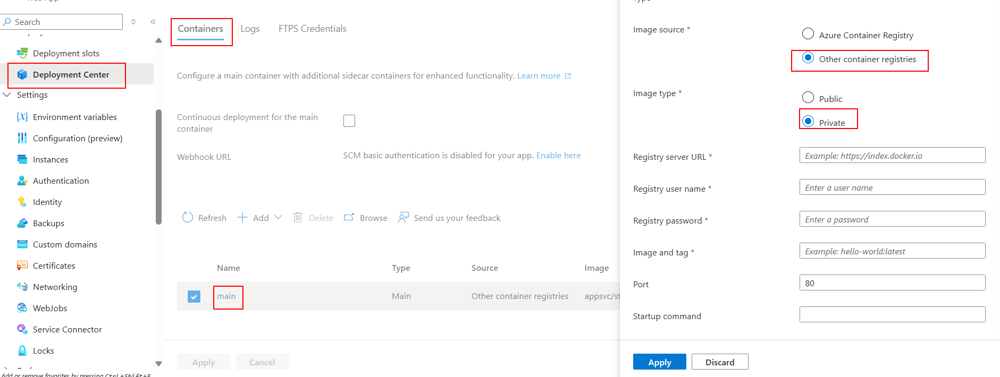

> [Offical Docs deploy to azure app](https://docs.github.com/en/actions/deployment/deploying-to-your-cloud-provider/deploying-to-azure/deploying-docker-to-azure-app-service)

If we want a public image we can use the previous uploaded image that we push to Docker Hub in the previous example or we can upload a private one using [Github Packages](https://github.com/features/packages).

> [Official Github Container Registry Docs](https://docs.github.com/en/packages/working-with-a-github-packages-registry/working-with-the-container-registry)

Create a new Github Personal Access Token:

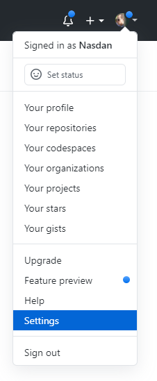


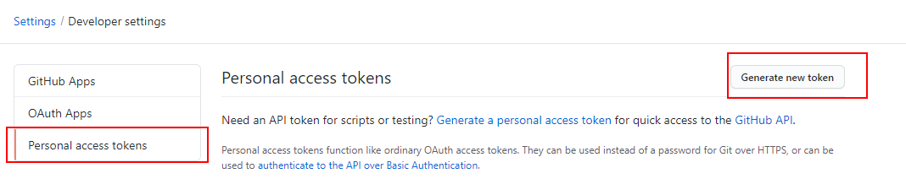

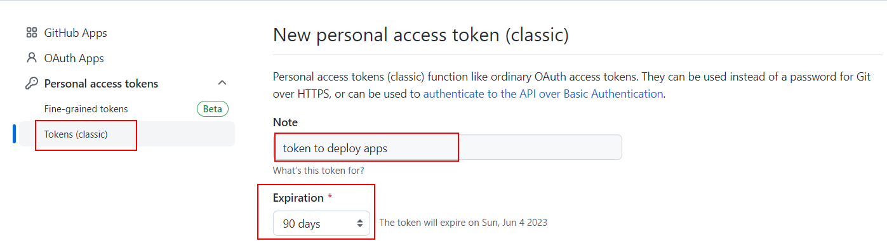


Clicks on _Generate token_ button and update values in Azure configuration section:

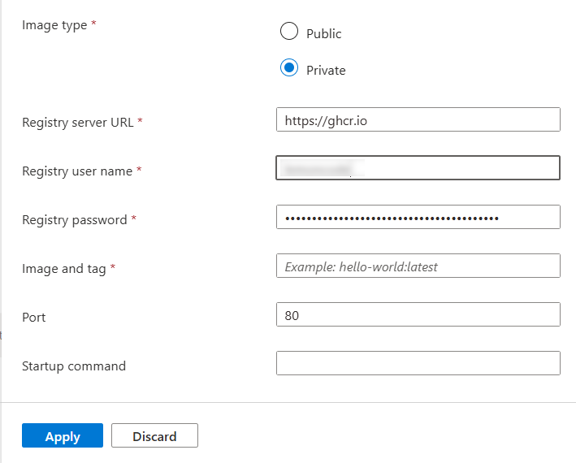

> DOCKER_REGISTRY_SERVER_URL: `https://ghcr.io`
>
> DOCKER_REGISTRY_SERVER_USERNAME: use your Github username or organization name instead of `lemoncode`.

Now we can create a Github Action workflow to deploy our app to Azure:

_./.github/workflows/cd.yml_

```yml
name: CD Workflow

on:
  push:
    branches:
      - main

env:
  IMAGE_NAME: ghcr.io/${{github.repository}}:${{github.run_number}}-${{github.run_attempt}}

permissions:
  contents: "read"
  packages: "write"
```

> `github.repository`: The repository name with the owner. For example, `octocat/hello-world`. You only can use this variable if it's lower case due to a Docker tag restriction: `--tag" flag: invalid reference format: repository name must be lowercase`
>
> For example, you can use `github.run_number` and `github.run_attempt` to create a unique image tag. But you can use any other tag.
>
> [Github context API](https://docs.github.com/en/actions/learn-github-actions/contexts#github-context)

Define job to build and push image to Github Container Registry:

_./.github/workflows/cd.yml_

```diff
...
permissions:
  contents: 'read'
  packages: 'write'

+ jobs:
+   cd:
+     runs-on: ubuntu-latest
+     steps:
+       - name: Checkout repository
+         uses: actions/checkout@v3

+       - name: Log in to GitHub container registry
+         uses: docker/login-action@v2
+         with:
+           registry: ghcr.io
+           username: ${{ github.actor }}
+           password: ${{ secrets.GITHUB_TOKEN }}

+       - name: Build and push docker image
+         run: |
+           docker build -t ${{env.IMAGE_NAME}} .
+           docker push ${{env.IMAGE_NAME}}

+       - name: Deploy to Azure
+         uses: azure/webapps-deploy@v2
+         with:
+           app-name: ${{ secrets.AZURE_APP_NAME }}
+           publish-profile: ${{ secrets.AZURE_PUBLISH_PROFILE }}
+           images: ${{env.IMAGE_NAME}}

```

> [GITHUB_TOKEN automatic token authentication](https://docs.github.com/en/actions/security-guides/automatic-token-authentication)

Create `secrets` in Github repository:

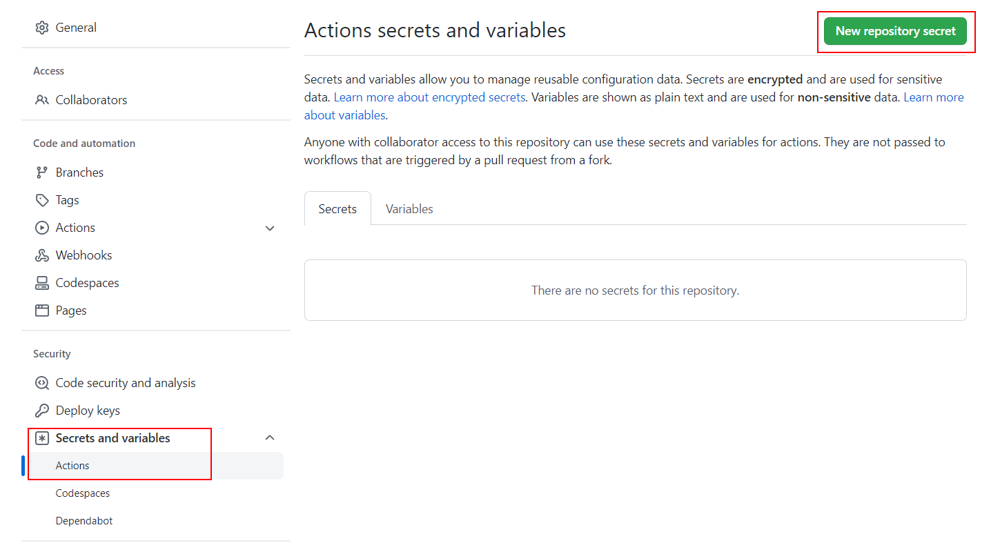

- `AZURE_APP_NAME` (same value as you name your app in Azure):

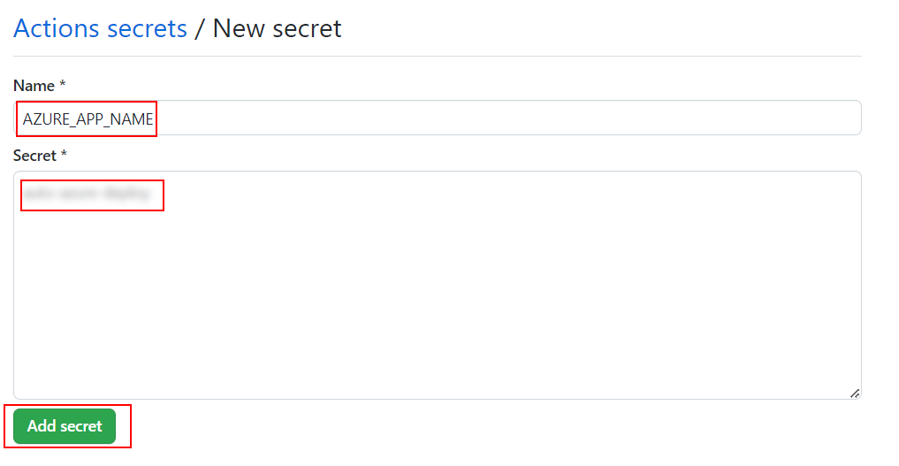

- `AZURE_PUBLISH_PROFILE` (you can download it from Azure portal and paste the value in the secret):

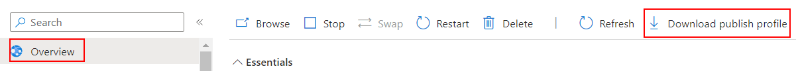


Upload changes:

```bash
git add .
git commit -m "create github workflow"
git push

```

After the successful deploy, open `https://<app-name>.azurewebsites.net`.

# About Basefactor + Lemoncode

We are an innovating team of Javascript experts, passionate about turning your ideas into robust products.

[Basefactor, consultancy by Lemoncode](http://www.basefactor.com) provides consultancy and coaching services.

[Lemoncode](http://lemoncode.net/services/en/#en-home) provides training services.

For the LATAM/Spanish audience we are running an Online Front End Master degree, more info: http://lemoncode.net/master-frontend
