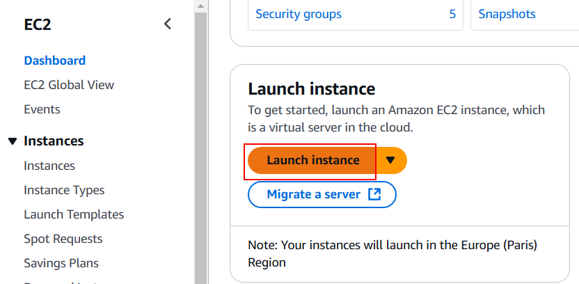
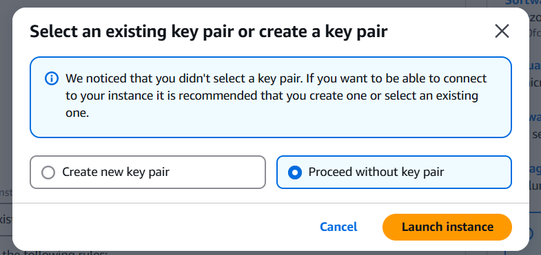
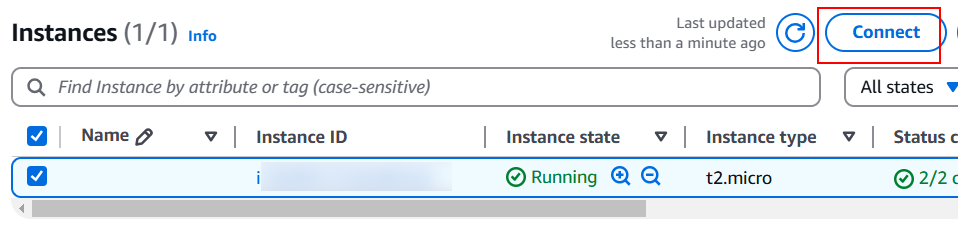
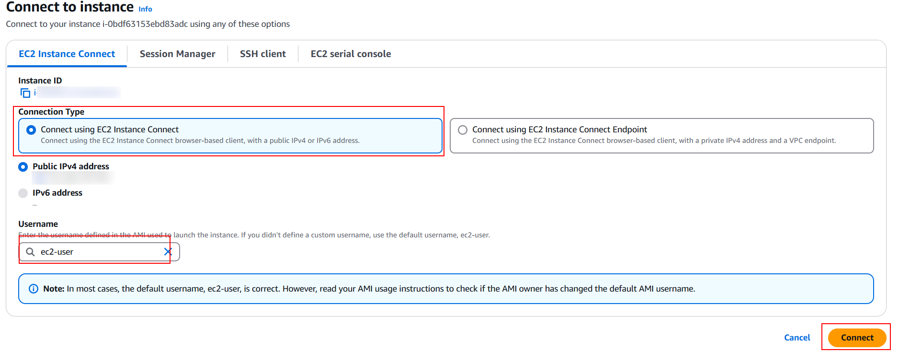

# 06 AWS deploy

In this example we are going to upload frontend app to Amazon Web Services

[Amazon EC2](https://aws.amazon.com/ec2/?ec2-whats-new.sort-by=item.additionalFields.postDateTime&ec2-whats-new.sort-order=desc) is an Amazon virtual machine.

> [Docker basics for Amazon EC2](https://docs.aws.amazon.com/AmazonECS/latest/developerguide/docker-basics.html)

Let's create an EC2 instance:



Select Amazon Machine Image:


Select Instance type:


Configure security group:


Clicks on `Launch instance` button and then `Proceed without a key pair`:



Connect to instance:





Install docker in AWS EC2 instance:

```bash
sudo yum update -y
sudo amazon-linux-extras install docker
sudo service docker start
# Optional step
sudo usermod -a -G docker ec2-user
```

> [Install docker on AWS EC2](https://docs.aws.amazon.com/AmazonECS/latest/developerguide/create-container-image.html)

Execute Docker image uploaded to Docker Hub in example `03-upload-docker-image`:

```bash
sudo docker run --name my-app-container --rm -d -p 80:8080 <user-name>/<app-name>:3
```

> In `tag 3` we had setted the port to `8080`

Open `http://<ec2-instance>.<region>.compute.amazonaws.com` remember with `HTTP` instead of `HTTPS`

# About Basefactor + Lemoncode

We are an innovating team of Javascript experts, passionate about turning your ideas into robust products.

[Basefactor, consultancy by Lemoncode](http://www.basefactor.com) provides consultancy and coaching services.

[Lemoncode](http://lemoncode.net/services/en/#en-home) provides training services.

For the LATAM/Spanish audience we are running an Online Front End Master degree, more info: http://lemoncode.net/master-frontend
