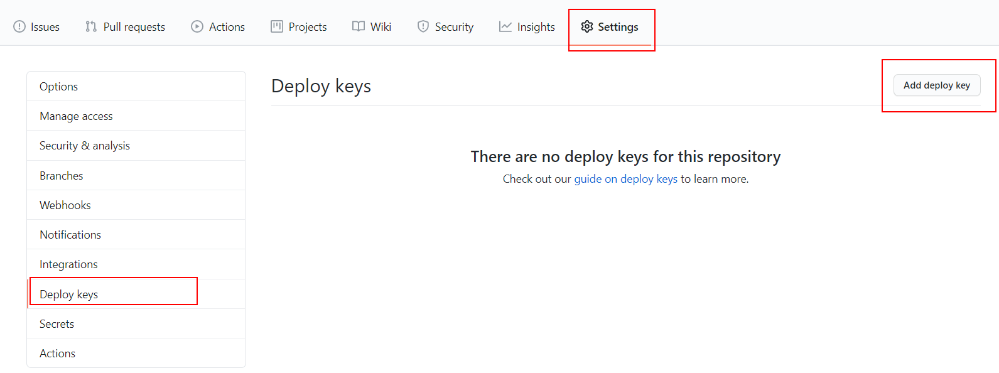

# 06-heroku-onde-dyno

In this example we are going to upload backend and frontend apps to one Heroku Dyno

We will start from `05-heroku-back/01-implementation`.

# Steps to build it

- `npm install` to install previous sample packages:

```bash
npm install
```

- If we want only one Heroku Dyno to serve this app, we can use backend server to public `static files`.

- Let's do it locally, we will create a `bash script file` to build front project inside backend project:

_./build-front.sh_

```bash
mkdir -p ./dist/public

cd ../<front-folder>
npm install
npm run build
cp -r ./dist/. ../<back-folder>/dist/public
```

> NOTE: Developers have to clone both repositories with same name as script has.

- Add npm commands:

_./pacakge.json_

```diff
...
  "scripts": {
    "start": "run-p -l type-check:watch start:dev start:local-db",
    "start:dev": "nodemon --exec babel-node --extensions \".ts\" src/index.ts",
+   "start:prod": "node dist/index.js",
    "start:local-db": "docker-compose up || echo \"Run docker-compose up manually\"",
    "stop:local-db": "docker-compose down || echo \"Run docker-compose down manually\"",
    "start:seed-data": "babel-node --extensions \".ts\" seed-data/index.ts",
    "build": "run-p -l type-check build:prod",
    "build:prod": "npm run clean && babel src -d dist --ignore=\"./src/test-runners\" --extensions \".ts\"",
+   "build:front": "sh ./build-front.sh",
    "type-check": "tsc --noEmit",
    "type-check:watch": "npm run type-check -- --watch",
    "clean": "rimraf dist"
  },
```

- We need to update `app.ts` to use this static files. Update `env variables`:

_./.env.example_

```diff
NODE_ENV=development
PORT=8081
CORS_ORIGIN=http://localhost:8080
MONGODB_URI=mongodb://localhost:27017/demo-cloud
+ STATIC_FILES_PATH=../dist/public
```

_./.env_

```diff
NODE_ENV=development
PORT=8081
CORS_ORIGIN=http://localhost:8080
MONGODB_URI=mongodb://localhost:27017/demo-cloud
+ STATIC_FILES_PATH=../dist/public

```

- Update constants:

_./src/core/env.constants_

```diff
export const envConstants = {
  isProduction: process.env.NODE_ENV === 'production',
  PORT: process.env.PORT,
  CORS_ORIGIN: process.env.CORS_ORIGIN,
  MONGODB_URI: process.env.MONGODB_URI,
+ STATIC_FILES_PATH: process.env.STATIC_FILES_PATH,
};

```

- Update app:

_./src/app.ts_

```diff
+ import express from 'express';
+ import path from 'path';
import { envConstants } from 'core/constants';
import { createApp } from 'core/servers';
import { connectToDB } from 'core/database';
import { memberApi } from 'pods/member';

const app = createApp();

app.use('/members', memberApi);

+ const staticFilesPath = path.resolve(__dirname, envConstants.STATIC_FILES_PATH);
+ app.use('/', express.static(staticFilesPath));

app.listen(envConstants.PORT, async () => {
  await connectToDB(envConstants.MONGODB_URI);
  console.log(`Server ready at PORT ${envConstants.PORT}`);
});

```

- Run build and start:

```bash
npm run build
npm run build:front

# First terminal
npm run start:prod

# Second terminal
npm run start:local-db
```

- This means that we don't need any cors configuration in `front` nor `back`. But we need a way to clone front repository in Dockerfile and build front project. That is, we need permissions to clone front repository, an ssh key:

```bash
ssh-keygen -m PEM -t rsa -C "cd-user@my-app.com"
```

- Copy `id_rsa.pub` content to `FRONTEND` project > `Github Settings` > `Deploy keys` section:




- Delete `id_rsa.pub` file.

- This time, we need to convert private ssh key to base64 due to the private `ssh key` is multiline:

```bash
base64 -w 0 < id_rsa
```

> References: [code and decode base64](https://linuxhint.com/bash_base64_encode_decode/)

- Copy base64 `id_rsa` content to `BACKEND` project > `Github Settings` > `Secrets` section:


- Delete `id_rsa` file.

- We can add the `FRONT_REPOSITORY_URL` secret too.

- Update the CD workflow file:

_./.github/workflows/cd.yml_

```diff
...
      - name: Build docker image
-       run: docker build -t ${{ secrets.HEROKU_APP_NAME }}:${{ github.run_id }} .
+       run: docker build --build-arg SSH_PRIVATE_KEY=${{ secrets.SSH_PRIVATE_KEY }} --build-arg FRONT_REPOSITORY_URL=${{ secrets.FRONT_REPOSITORY_URL }} -t ${{ secrets.HEROKU_APP_NAME }}:${{ github.run_id }} .
      - name: Deploy docker image
        run: |
          docker tag ${{ secrets.HEROKU_APP_NAME }}:${{ github.run_id }} registry.heroku.com/${{ secrets.HEROKU_APP_NAME }}/web
          docker push registry.heroku.com/${{ secrets.HEROKU_APP_NAME }}/web
      - name: Release
        run: heroku container:release web -a ${{ secrets.HEROKU_APP_NAME }}

```

> [Docker build-arg](https://docs.docker.com/engine/reference/commandline/build/#set-build-time-variables---build-arg)

- Update Dockerfile:

_./Dockerfile_

```diff
FROM node:12-alpine AS base
RUN mkdir -p /usr/app
WORKDIR /usr/app

+ # Build frontend
+ FROM base AS build-frontend
+ ARG SSH_PRIVATE_KEY
+ RUN mkdir -p ~/.ssh/
+ RUN echo "$SSH_PRIVATE_KEY" | base64 -d > ~/.ssh/id_rsa
+ RUN chmod 600 ~/.ssh/id_rsa
+ RUN apk add --no-cache git openssh
+ RUN ssh-keyscan github.com >> ~/.ssh/known_hosts
+ RUN git config --global user.email "cd-user@my-app.com"
+ RUN git config --global user.name "cd-user"
+ ARG FRONT_REPOSITORY_URL
+ RUN git clone $FRONT_REPOSITORY_URL ./
+ RUN npm install
+ RUN npm run build

# Build backend
FROM base AS build-backend
COPY ./ ./
RUN npm install
RUN npm run build

# Release
FROM base AS release
COPY --from=build-backend /usr/app/dist ./
+ COPY --from=build-frontend /usr/app/dist ./public
COPY ./package.json ./
RUN npm install --only=production

ENTRYPOINT [ "node", "index" ]

```

- Commit and push.

- Update heroku portal env variables:

```diff
+ CORS_ORIGIN=false
+ STATIC_FILES_PATH=./public
```

# About Basefactor + Lemoncode

We are an innovating team of Javascript experts, passionate about turning your ideas into robust products.

[Basefactor, consultancy by Lemoncode](http://www.basefactor.com) provides consultancy and coaching services.

[Lemoncode](http://lemoncode.net/services/en/#en-home) provides training services.

For the LATAM/Spanish audience we are running an Online Front End Master degree, more info: http://lemoncode.net/master-frontend
