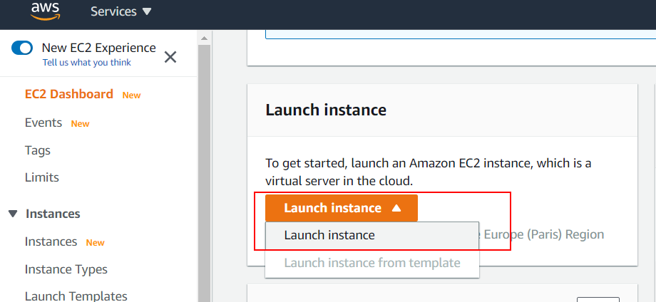
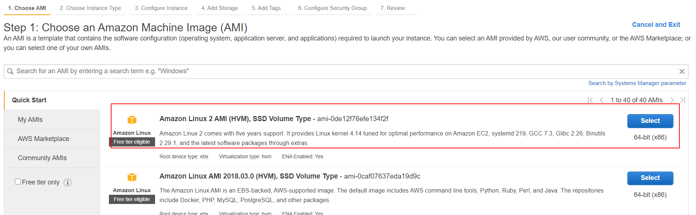
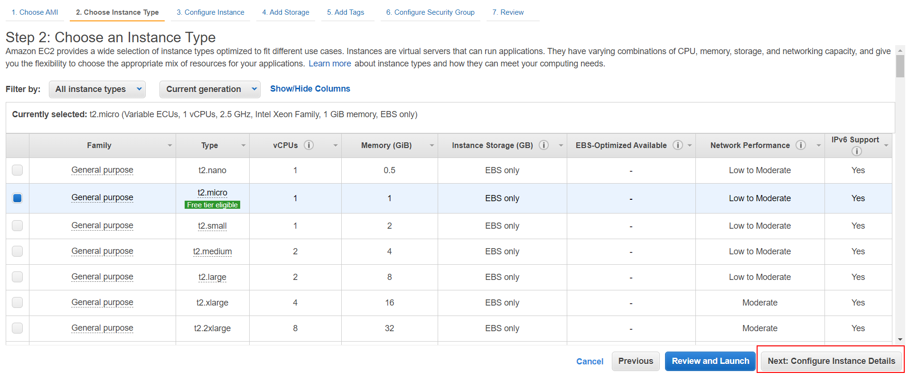
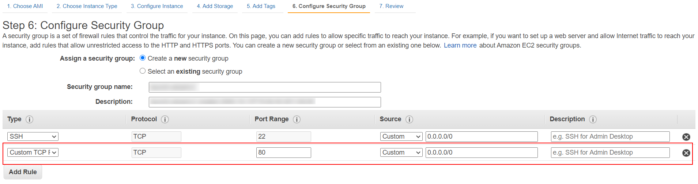
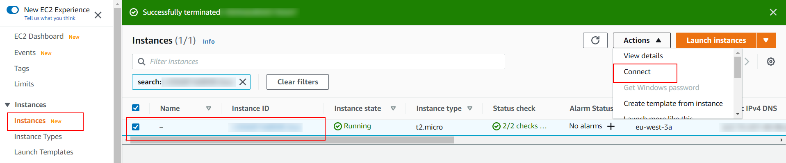
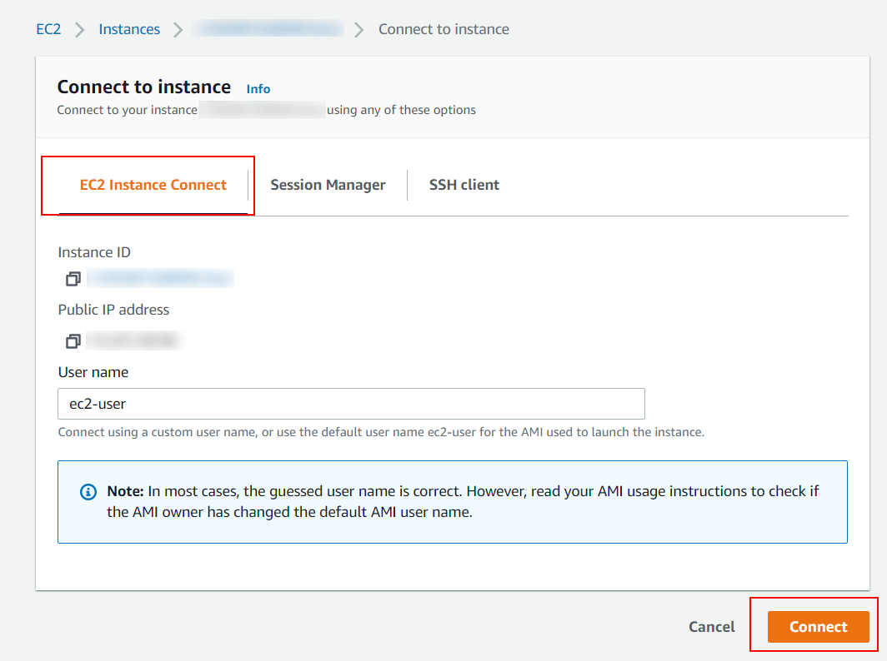

# 07 AWS front

In this example we are going to upload frontend app to Amazon Web Services

We will start from `05-heroku-back/01-implementation`.

# Steps to build it

- `npm install` to install previous sample packages:

```bash
npm install
```

- [Amazon EC2](https://aws.amazon.com/ec2/?ec2-whats-new.sort-by=item.additionalFields.postDateTime&ec2-whats-new.sort-order=desc) is an Amazon virtual machine.

> [Docker basics for Amazon EC2](https://docs.aws.amazon.com/AmazonECS/latest/developerguide/docker-basics.html)

- Let's create an EC2 instance:



- Select Amazon Machine Image:



- Select Instance type:



- Configure security group:



- Connect to instance:





- Install docker in AWS EC2 instance:

```bash
sudo yum update -y
sudo amazon-linux-extras install docker
sudo service docker start
# Optional step
sudo usermod -a -G docker ec2-user
```

- Execute Docker image uploaded to Docker Hub in example `03-upload-docker-image`:

```bash
sudo docker run --rm -d -p 80:8000 <user-name>/<app-name>:<tag>
```

# About Basefactor + Lemoncode

We are an innovating team of Javascript experts, passionate about turning your ideas into robust products.

[Basefactor, consultancy by Lemoncode](http://www.basefactor.com) provides consultancy and coaching services.

[Lemoncode](http://lemoncode.net/services/en/#en-home) provides training services.

For the LATAM/Spanish audience we are running an Online Front End Master degree, more info: http://lemoncode.net/master-frontend
