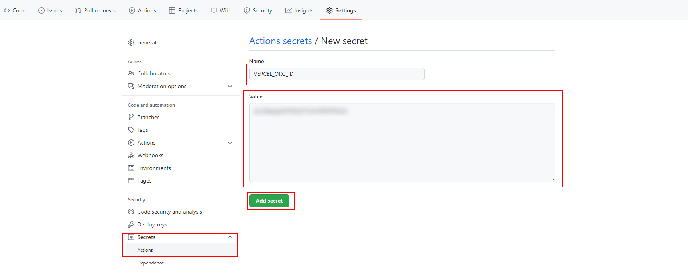

# 05 Vercel

In this example we are going to upload Docker image with a front app to Vercel.

We will start from `04-heroku-front`.

# Steps to build it

- `npm install` to install previous sample packages:

```bash
npm install
```

- We will configure the [Github Actions](https://docs.github.com/en/free-pro-team@latest/actions) as we did in `02-github-actions` example.

- Create new repository and upload files:

```bash
git init
git remote add origin git@github.com...
git add .
git commit -m "initial commit"
git push -u origin master
```

- If we navigate to `https://vercel.com/`, it provides deploy project from `Git repository` or `Clone a template`, but what if we want to use `Github Actions`?

- We can use [Vercel CLI](https://vercel.com/docs/cli):

```bash
npm i -g vercel
```

- Link current code with a new project in vercel:

```bash
vercel login
vercel link
```

> It creates a `.vercel` folder with `projectId` and `orgId` info
> and new project in `vercel.com`

- Following official docs for [custom workflows](https://vercel.com/support/articles/using-vercel-cli-for-custom-workflows) we will add `ProjectId` to repository as secrets:


- Add `OrgId` to repository secrets:



- Create new workflow

_./.github/workflows/vercel-cd.yml_

```yml
name: Vercel Continuos Deployment workflow

on:
  push:
    branches:
      - master
env:
  VERCEL_PROJECT_ID: ${{ secrets.VERCEL_PROJECT_ID }}
  VERCEL_ORG_ID: ${{ secrets.VERCEL_ORG_ID }}
```

- Remove `.vercel` folder from repository.

- Create token in [your account](https://vercel.com/account/tokens)

> [Token API docs](https://vercel.com/docs/cli#introduction/global-options/token)

- Add `token` to repository secrets:


- Update workflow:

_./.github/workflows/vercel-cd.yml_

```diff
name: Vercel Continuos Deployment workflow

on:
  push:
    branches:
      - master
env:
  VERCEL_PROJECT_ID: ${{ secrets.VERCEL_PROJECT_ID }}
  VERCEL_ORG_ID: ${{ secrets.VERCEL_ORG_ID }}

+ jobs:
+   vercel-cd:
+     runs-on: ubuntu-latest
+     steps:
+       - name: Checkout repository
+         uses: actions/checkout@v3
+       - name: Deploy
+         run: vercel -t ${{ secrets.VERCEL_TOKEN }}
```

- Review builds steps on deploy in Vercel Project Settings:


- Git commit and push:

```bash
git add .
git commit -m "update vercel cd file"
git push
```

> [Not supported Docker deploys](https://vercel.com/support/articles/does-vercel-support-docker-deployments)

# About Basefactor + Lemoncode

We are an innovating team of Javascript experts, passionate about turning your ideas into robust products.

[Basefactor, consultancy by Lemoncode](http://www.basefactor.com) provides consultancy and coaching services.

[Lemoncode](http://lemoncode.net/services/en/#en-home) provides training services.

For the LATAM/Spanish audience we are running an Online Front End Master degree, more info: http://lemoncode.net/master-frontend
