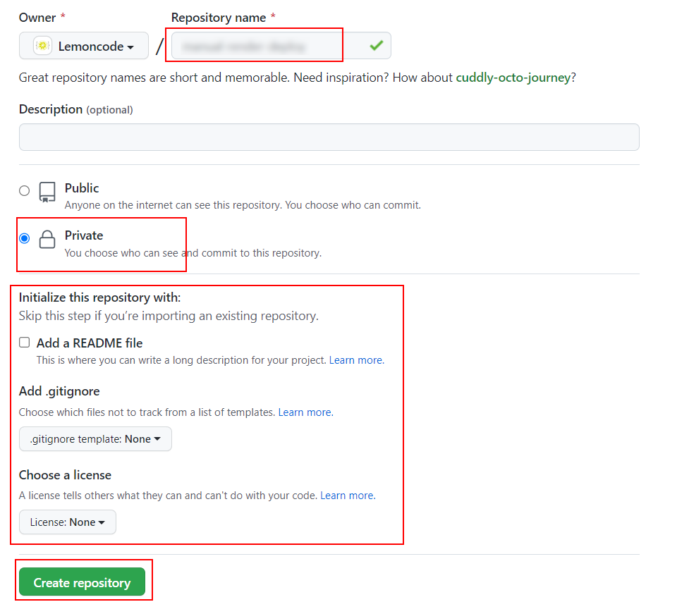
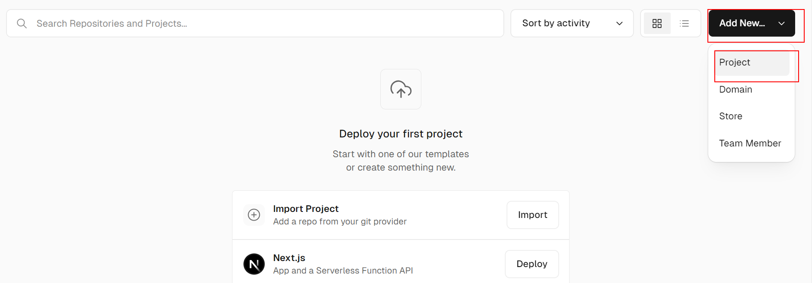
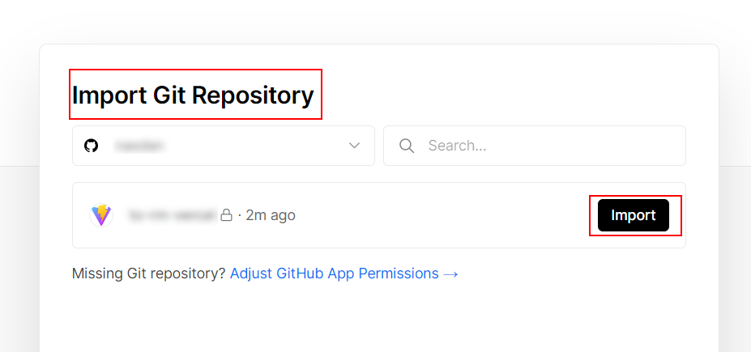
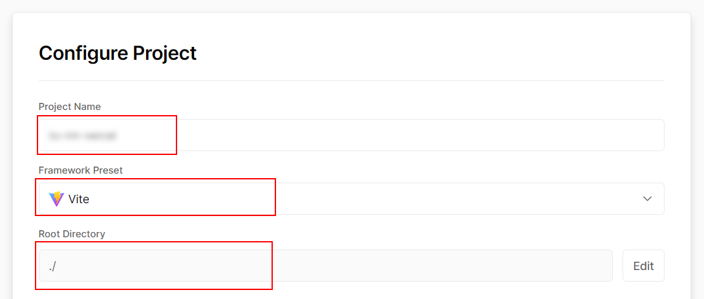
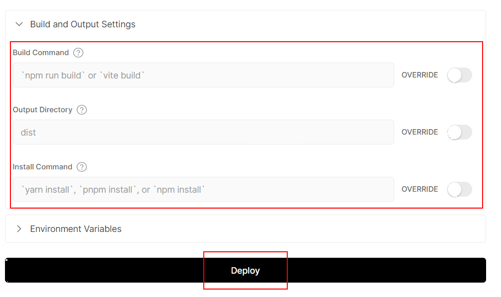

# 01 Vercel

In this example we are going to upload a front app to Vercel.

We will start from `04-manual-render-deploy`.

# Steps to build it

`npm install` to install previous sample packages:

```bash
npm install
```

[Vercel](https://vercel.com/) is a cloud provider that allows you to deploy front end apps based on git repository changes.

Create new repository and upload files:



```bash
git init
git remote add origin git@github.com...
git add .
git commit -m "initial commit"
git push -u origin main

```

Create a new _Vercel_ app:



After give permissions to Vercel, we can import the repository:



Configure basic project settings:



Check build options and deploy:



After the successful deploy, open `https://<app-name>.vercel.app`.

> [Not supported Docker deploys](https://vercel.com/support/articles/does-vercel-support-docker-deployments)

# About Basefactor + Lemoncode

We are an innovating team of Javascript experts, passionate about turning your ideas into robust products.

[Basefactor, consultancy by Lemoncode](http://www.basefactor.com) provides consultancy and coaching services.

[Lemoncode](http://lemoncode.net/services/en/#en-home) provides training services.

For the LATAM/Spanish audience we are running an Online Front End Master degree, more info: http://lemoncode.net/master-frontend
