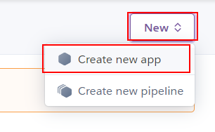

# 05-heroku-back

In this example we are going to upload Docker image with a backend app to Heroku.

We will start from `04-heroku-front` and `00-backend-start`.

# Steps to build it

- `npm install` to install previous sample packages:

```bash
npm install
```

- This app is using a [mongodb database](https://www.mongodb.com/), instead of [download and install the MongoDB software](https://docs.mongodb.com/manual/administration/install-community/) we can use [docker to run an MongoDB](https://hub.docker.com/_/mongo) instance for local development.

```bash
docker run --name my-mongo-db -p 27017:27017 -d --rm mongo:5
docker ps
```

> [Default mongodb port](https://docs.mongodb.com/manual/reference/default-mongodb-port/)

- Let's connect to mongodb instance and create some data:

```bash
docker exec -it my-mongo-db sh

# Inside Docker container instance
mongo
show dbs
use my-db
show collections
db.clients.insert({ name: "Client 1" })
show collections
db.clients.find().pretty()
exit
exit

# Remove container
docker stop my-mongo-db
```

- We will use same approach but using [`Docker Compose`](https://docs.docker.com/compose/):

- First, we need to create a `.env` file with same data as `.env.example`:

_./.env_

```
NODE_ENV=development
PORT=8081
CORS_ORIGIN=http://localhost:8080
MONGODB_URI=mongodb://localhost:27017/demo-cloud

```

```bash
# In first terminal
docker-compose up

# In second terminal
docker ps
docker exec -it mongo-demo-cloud sh
mongo
show dbs

# In third terminal
npm run start:seed-data

# In second terminal
show dbs
use demo-cloud
db.members.find().pretty()
exit
exit
```

> [MongoDB Compass](https://www.mongodb.com/try/download/compass)

- Close second and third terminal and run in the first one:

```bash
npm start
```

> Open browser in http://localhost:8081/members/lemoncode

- We will configure the [Github Actions](https://docs.github.com/en/free-pro-team@latest/actions) as we did in `04-heroku-front` example.

- Create new repository and upload files:

```bash
git init
git remote add origin git@github.com...
git add .
git commit -m "initial commit"
git push -u origin master
```

- We need create a [new heroku app](https://dashboard.heroku.com/) to deploy it.




- This time, we need an [auth token](https://devcenter.heroku.com/articles/heroku-cli-commands#heroku-authorizations-create) to heroku login inside Github Action job:

```bash
heroku login
heroku authorizations:create -d <description>
```

> -d: Set a custom authorization description
> -e: Set expiration in seconds (default no expiration)
> `heroku authorizations`: Get auth token list.

- Add `Auth token` to git repository secrets:


> [Heroku API KEY storage](https://devcenter.heroku.com/articles/heroku-cli-commands#heroku-authorizations-create)

- We can add `HEROKU_APP_NAME` as secret too:


- Now, we can defined another file for `Continuos Deployment workflow`. (It's `the same as frontend` cd workflow):

_./.github/workflows/cd.yml_

```yml
name: Continuos Deployment workflow

on:
  push:
    branches:
      - master
env:
  HEROKU_API_KEY: ${{ secrets.HEROKU_API_KEY }}
  IMAGE_NAME: registry.heroku.com/${{ secrets.HEROKU_APP_NAME }}/web

jobs:
  cd:
    runs-on: ubuntu-latest
    steps:
      - name: Checkout repository
        uses: actions/checkout@v3
      - name: Heroku login
        run: heroku container:login
      - name: Build docker image
        run: docker build -t ${{ env.IMAGE_NAME }} .
      - name: Deploy docker image
        run: docker push ${{ env.IMAGE_NAME }}
      - name: Release
        run: heroku container:release web -a ${{ secrets.HEROKU_APP_NAME }}

```

> It's the same file as front project.

- Add Dockerfile:

_./Dockerfile_

```Dockerfile
FROM node:16-alpine AS base
RUN mkdir -p /usr/app
WORKDIR /usr/app

# Build backend
FROM base AS build-backend
COPY ./ ./
RUN npm ci
RUN npm run build

# Release
FROM base AS release
COPY --from=build-backend /usr/app/dist ./
COPY ./package.json ./
COPY ./package-lock.json ./
RUN npm ci --only=production

ENTRYPOINT [ "node", "index" ]


```

- Create commit and push.

```bash
git add .
git commit -m "add cd and Dockerfile files"
git push
```

- Check `https://<heroku-app-name>.herokuapp.com/members/facebook`. It's not working because we need provide env variables.

```bash
heroku logs -a <name>
```

- Navigate to [Mongo Atlas](https://www.mongodb.com/atlas/database) to get `MONGODB_URI`.

- Let's update `env variables` in heroku portal:


```
NODE_ENV=production
CORS_ORIGIN=https://<heroku-app-name>.herokuapp.com
MONGODB_URI=...

```

> CORS_ORIGIN: Provide Heroku frontend app.
>
> IMPORTANT: remove last `/` in CORS_ORIGIN
>
> We already have deployed a MongoAtlas database

- Check again: `https://<heroku-app-name>.herokuapp.com/members/facebook`

# Update front project

- Update `api`:

_./src/pods/list/api/list.api.ts_

```diff
import Axios from 'axios';
import { Member } from './list.api-model';

+ const url = `${process.env.BASE_API_URL}/members`;

export const getMemberList = async (
  organization: string
): Promise<Member[]> => {
  const { data } = await Axios.get(
-   `https://api.github.com/orgs/${organization}/members`
+   `${url}/${organization}`
  );
  return data;
};

```

_./dev.env_

```diff
NODE_ENV=development
ORGANIZATION=lemoncode
+ BASE_API_URL=http://localhost:8081

```

_./config/webpack/prod.js_

```diff
...
  plugins: [
    new Dotenv({
      path: 'prod.env',
+     systemvars: true,
    }),
  ],
});
```

- Update `cd workflow`:

_./.github/workflows/cd.yml_

```diff
...

      - name: Build docker image
-       run: docker build -t ${{ env.IMAGE_NAME }} .
+       run: docker build -t ${{ env.IMAGE_NAME }} --build-arg BASE_API_URL=${{secrets.BASE_API_URL}} .
...
```

- And Docker:

_./Dockerfile_

```diff
...

# Prepare static files
FROM base AS build-front
+ ARG BASE_API_URL
+ ENV BASE_API_URL=$BASE_API_URL
COPY ./ ./
RUN npm install
RUN npm run build

...
```

- Create `BASE_API_URL` and copy Heroku Backend server as secret too (in `FRONT` Repository):


> IMPORTANT: remove last `/`

- Commit push `frontend repository`.

```bash
git add .
git commit -m "update front project"
git push

```

Open Heroku Front app `https://<heroku-app-name>.herokuapp.com/`

# About Basefactor + Lemoncode

We are an innovating team of Javascript experts, passionate about turning your ideas into robust products.

[Basefactor, consultancy by Lemoncode](http://www.basefactor.com) provides consultancy and coaching services.

[Lemoncode](http://lemoncode.net/services/en/#en-home) provides training services.

For the LATAM/Spanish audience we are running an Online Front End Master degree, more info: http://lemoncode.net/master-frontend
