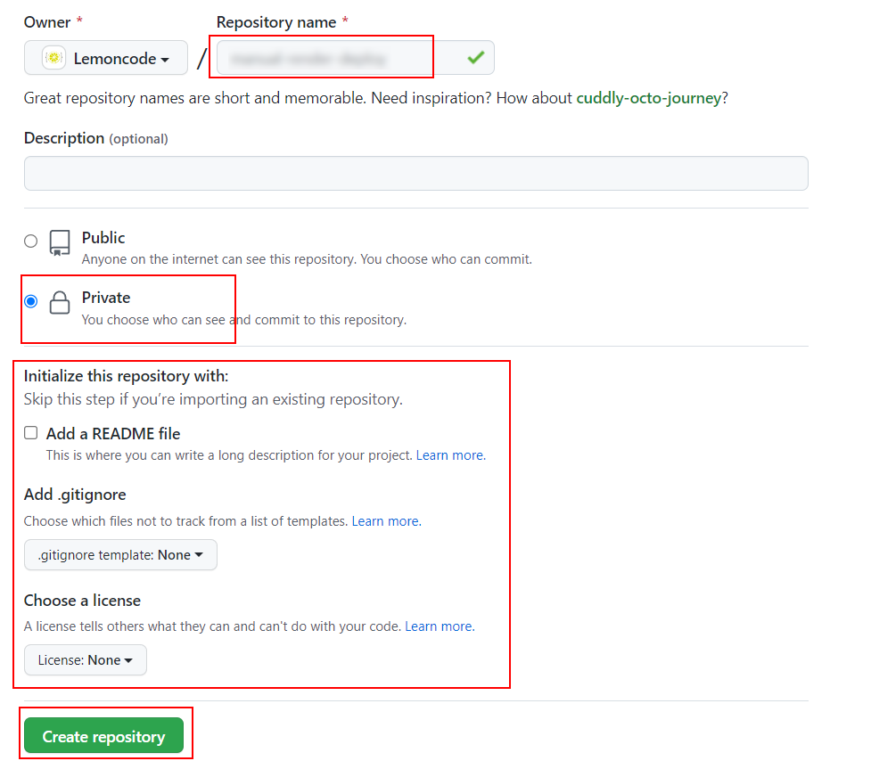
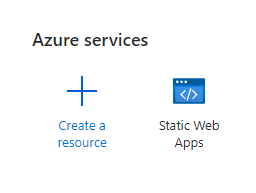
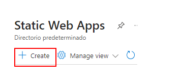
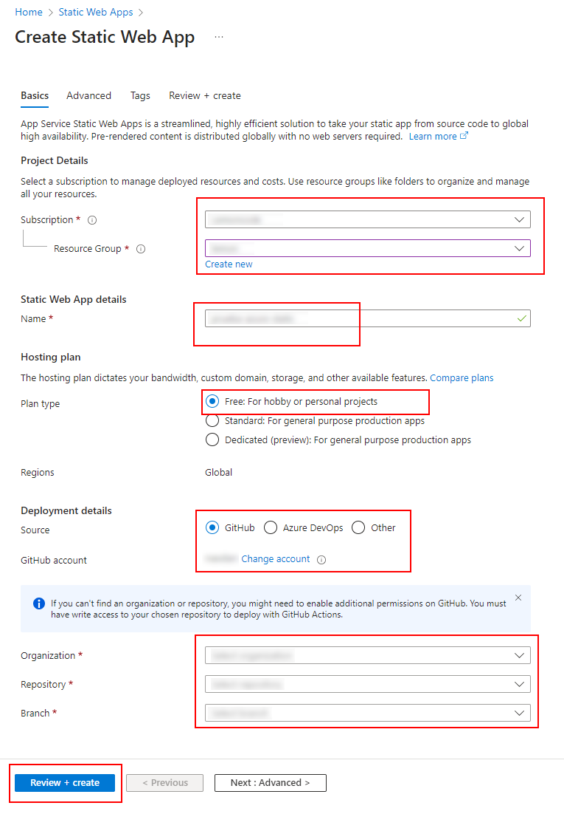
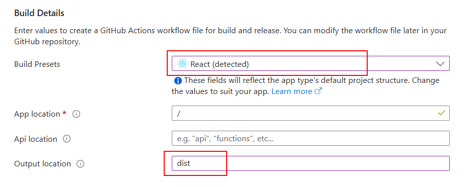
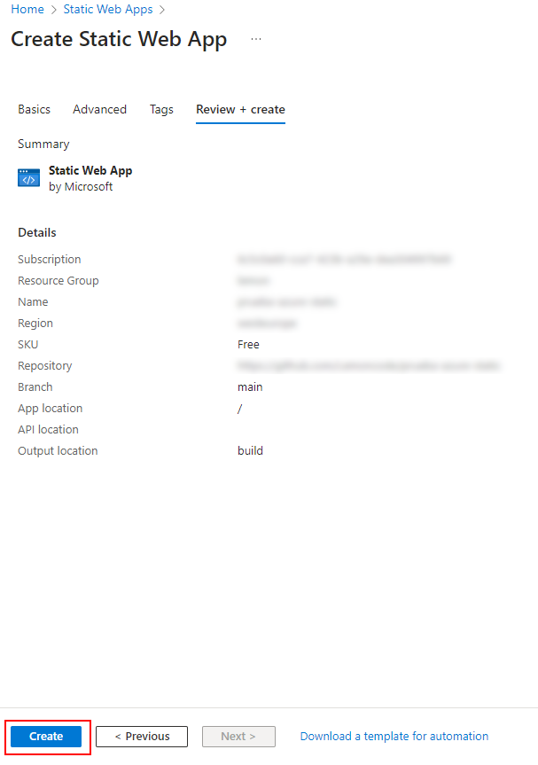
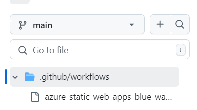
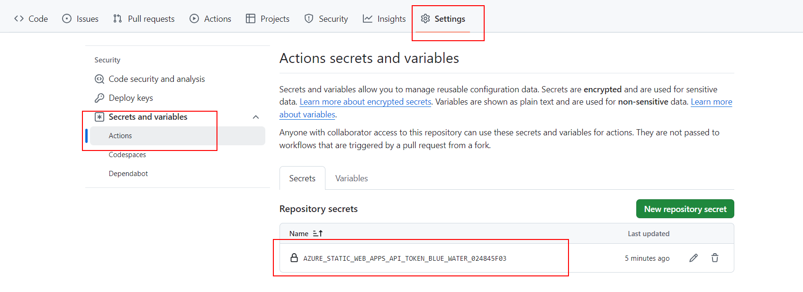

# 05 Azure Static

In this example we are going to upload a front app to Azure using an Static Web App.

We will start from `04-manual-render-deploy`.

# Steps to build it

`npm install` to install previous sample packages:

```bash
npm install
```

Create new repository and upload files:



```bash
git init
git remote add origin git@github.com...
git add .
git commit -m "initial commit"
git push -u origin main

```

Create a new _Azure Static Web App_:





Configure the app:



Build details:



Review and create:



Once we click on `Create`, Azure will create automatically a new Github Workflow in your repository like:



And a new `Action Secret`:



Let's download the new repository changes to local:

```bash
git pull
```

Since the Github workflow is a generic template, we will remove all content but preserve the secrect and add the following content:

_./github/workflows/cd.yml_

```yml
name: CD Workflow

on:
  push:
    branches:
      - main

jobs:
  cd:
    environment:
      name: 'My Static Web App'
      # Replace <YOUR_WEB_STATIC_URL> with the url of your static web app
      url: <YOUR_WEB_STATIC_URL>
    runs-on: ubuntu-latest
    name: Build and Deploy Job
    steps:
      - name: Checkout repository
        uses: actions/checkout@v4

      - name: Install
        run: npm ci

      - name: Build
        run: npm run build

      - name: Deploy
        uses: Azure/static-web-apps-deploy@v1
        with:
          # Replace <YOUR_AUTO_GENERATED_TOKEN> with the name of your secret token
          azure_static_web_apps_api_token: ${{ secrets.<YOUR_AUTO_GENERATED_TOKEN> }}
          repo_token: ${{ secrets.GITHUB_TOKEN }}
          action: "upload"
          app_location: "/dist"
          skip_app_build: true
          skip_api_build: true
        env:
          NODE_VERSION: 22.16.0

```

> Visit official documentation to get more info about [Azure Static Web Apps Config Props](https://aka.ms/swaworkflowconfig)

Upload changes:

```bash
git add .
git commit -m "update cd github workflow"
git push

```

# About Basefactor + Lemoncode

We are an innovating team of Javascript experts, passionate about turning your ideas into robust products.

[Basefactor, consultancy by Lemoncode](http://www.basefactor.com) provides consultancy and coaching services.

[Lemoncode](http://lemoncode.net/services/en/#en-home) provides training services.

For the LATAM/Spanish audience we are running an Online Front End Master degree, more info: http://lemoncode.net/master-frontend
