# 06 Azure site container

In this example we are going to upload the Github Action to deploy the Docker container as a site container in Azure.

We will start from `04-auto-azure-deploy`.

# Steps to build it

`npm install` to install previous sample packages:

```bash
npm install
```

Create new repository and upload files:


```bash
git init
git remote add origin git@github.com...
git add .
git commit -m "initial commit"
git push -u origin main

```

[Configure sidecars container in Azure](https://learn.microsoft.com/en-us/azure/app-service/configure-sidecar) allow us to deploy multiple containers in the same app instance. This is useful to deploy a main container with our app (it will be the only one receiving external traffic) and a sidecar container with a monitoring tool, for example.

Update the Github Action to deploy with the new configuration:

_./.github/workflows/cd.yml_

```diff
name: CD Workflow

on:
  push:
    branches:
      - main

env:
  IMAGE_NAME: ghcr.io/${{github.repository}}:${{github.run_number}}-${{github.run_attempt}}

permissions:
  contents: 'read'
  packages: 'write'

jobs:
  cd:
    runs-on: ubuntu-latest
    steps:
      - name: Checkout repository
        uses: actions/checkout@v6

      - name: Log in to GitHub container registry
        uses: docker/login-action@v3
        with:
          registry: ghcr.io
          username: ${{ github.actor }}
          password: ${{ secrets.GITHUB_TOKEN }}

      - name: Build and push docker image
        run: |
          docker build -t ${{env.IMAGE_NAME}} .
          docker push ${{env.IMAGE_NAME}}

      - name: Deploy to Azure
        uses: azure/webapps-deploy@v3
        with:
          app-name: ${{ secrets.AZURE_APP_NAME }}
          publish-profile: ${{ secrets.AZURE_PUBLISH_PROFILE }}
-         images: ${{env.IMAGE_NAME}}
+         sitecontainers-config: >-
+           [
+           {
+               "name": "main",
+               "image": "${{env.IMAGE_NAME}}",
+               "targetPort": 8080,
+               "isMain": true,
+               "userName": "${{ github.actor }}",
+               "passwordSecret": "${{ secrets.GITHUB_TOKEN }}"
+             }
+           ]

```

> [Example of site container configuration in Github Action](https://github.com/Azure/actions-workflow-samples/blob/master/AppService/sitecontainers-webapp-on-azure.yml)

As we see it fails because is not supported the publish-profile: `Deployment Failed, Error: publish-profile is not supported for Site Containers scenario`. We need to use a [managed identity](https://learn.microsoft.com/en-us/entra/identity/managed-identities-azure-resources/overview) to deploy the site container.

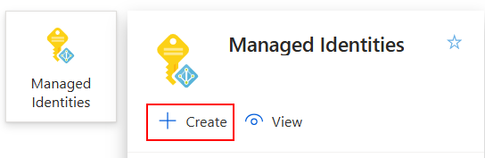

Fill the details of the managed identity:

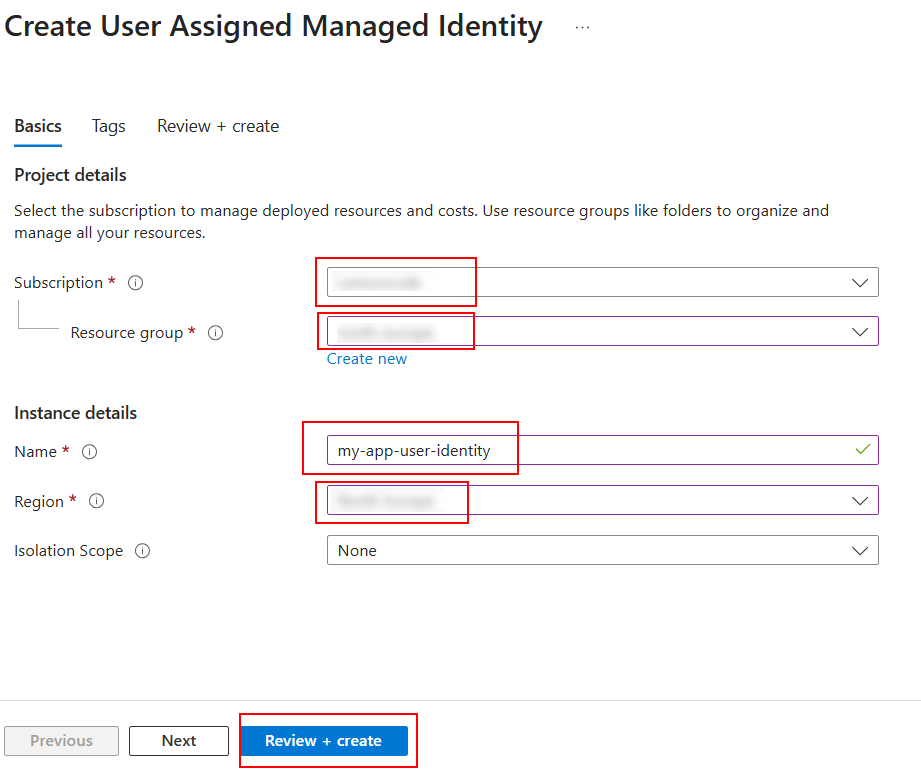

Once created, we need to configure the federated credential to allow Github Action to use it:

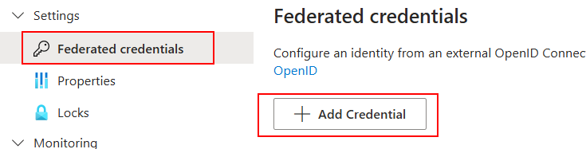

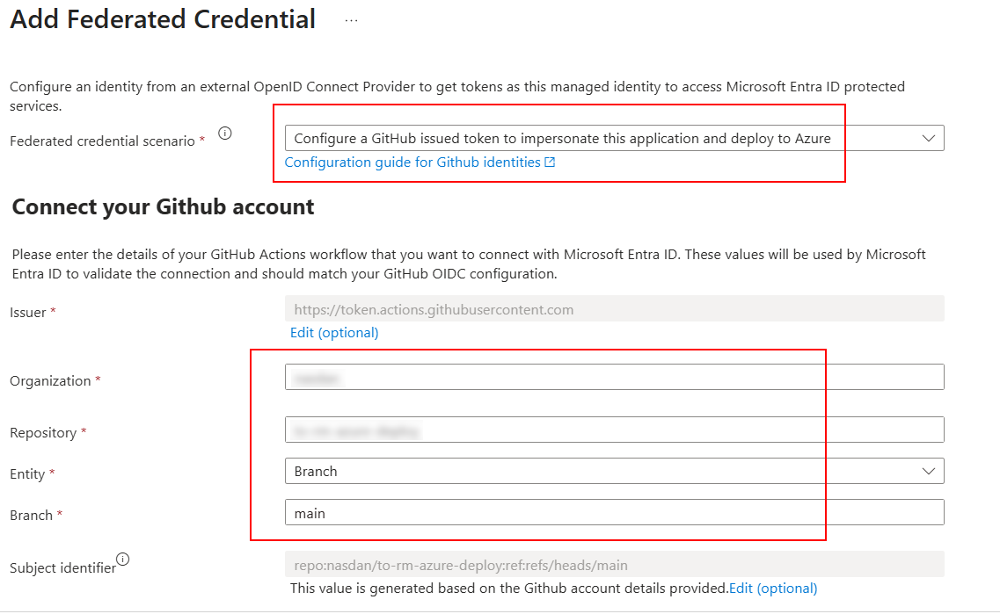

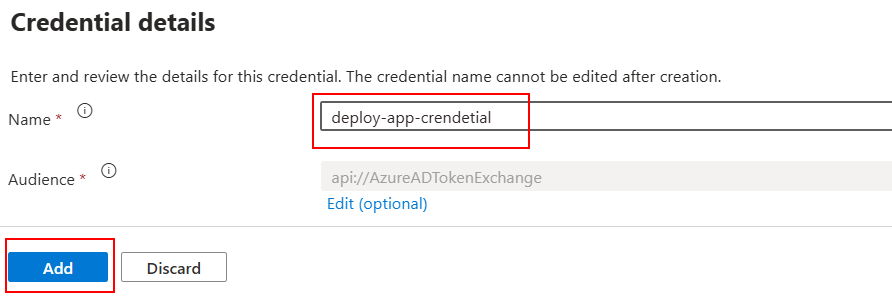

Using the user assigned managed identity in the Web App:

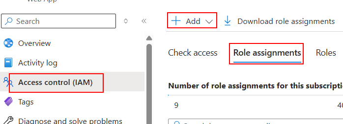

Assign role `Contributor` to the managed identity:

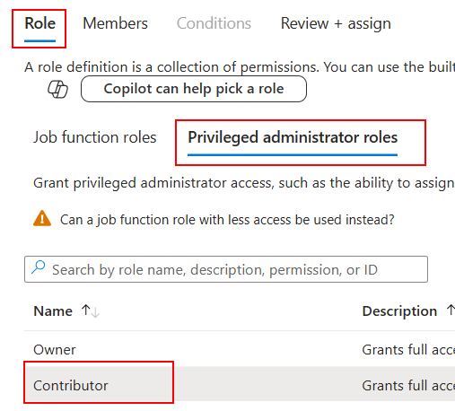

Assign the user assigned managed identity as member:

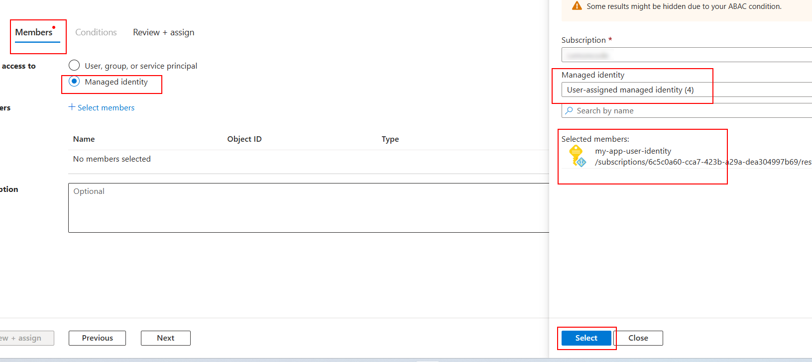

Disable basic authentication in the Web App:

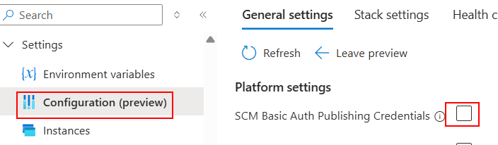

And finally, we can remove the environment variables related to basic authentication in the Github Action:

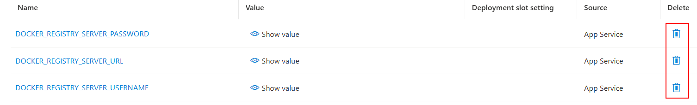

Finally, we need to update the Github Action to use the user assigned managed identity:

_./.github/workflows/cd.yml_

```diff
name: CD Workflow

on:
  push:
    branches:
      - main

env:
  IMAGE_NAME: ghcr.io/${{github.repository}}:${{github.run_number}}-${{github.run_attempt}}

permissions:
  contents: 'read'
  packages: 'write'
+ id-token: 'write'

jobs:
  cd:
    runs-on: ubuntu-latest
    steps:
      - name: Checkout repository
        uses: actions/checkout@v6

      - name: Log in to GitHub container registry
        uses: docker/login-action@v3
        with:
          registry: ghcr.io
          username: ${{ github.actor }}
          password: ${{ secrets.GITHUB_TOKEN }}

      - name: Build and push docker image
        run: |
          docker build -t ${{env.IMAGE_NAME}} .
          docker push ${{env.IMAGE_NAME}}

+     # Docs: https://github.com/marketplace/actions/azure-login#input-parameters
+     - name: Login Azure
+       uses: azure/login@v2
+       with:
+         client-id: ${{ secrets.AZURE_CLIENT_ID }}
+         tenant-id: ${{ secrets.AZURE_TENANT_ID }}
+         subscription-id: ${{ secrets.AZURE_SUBSCRIPTION_ID }}

      - name: Deploy to Azure
        uses: azure/webapps-deploy@v3
        with:
          app-name: ${{ secrets.AZURE_APP_NAME }}
-         publish-profile: ${{ secrets.AZURE_PUBLISH_PROFILE }}
          sitecontainers-config: >-
            [
            {
                "name": "main",
                "image": "${{env.IMAGE_NAME}}",
                "targetPort": 8080,
                "isMain": true,
                "userName": "${{ github.actor }}",
                "passwordSecret": "${{ secrets.GITHUB_TOKEN }}"
              }
            ]

```

> `id-token: 'write'` is required to allow the Github Action to request an OIDC token to authenticate with Azure using the federated credential.

Adding `Client ID`:

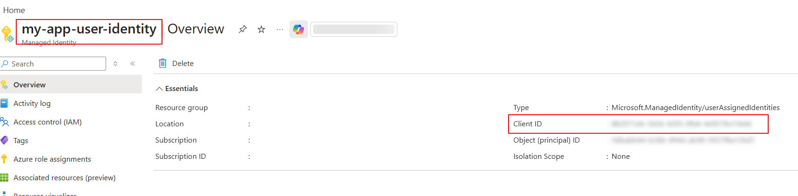

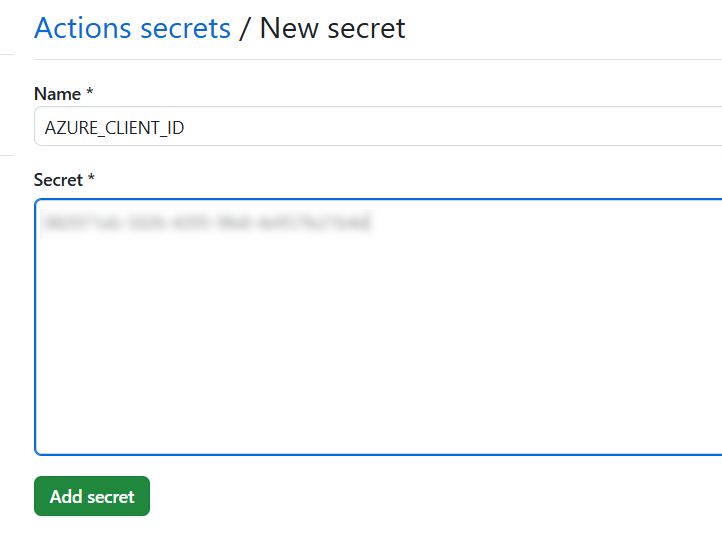

Clicks on Microsoft Entra ID to get the `Tenant ID`:

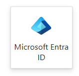

Adding `Tenant ID`:

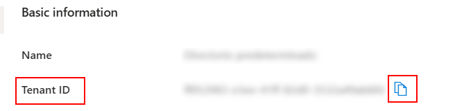

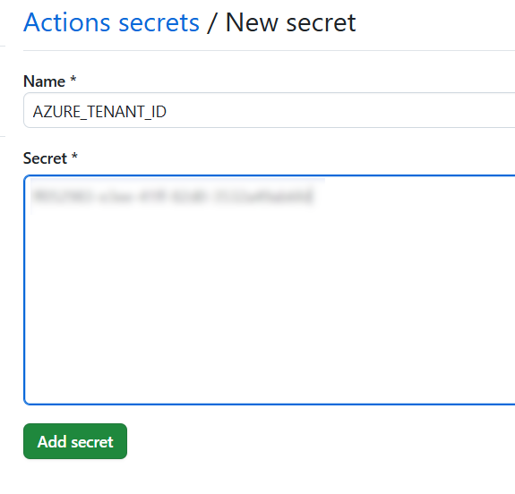

Adding `Subscription ID`:


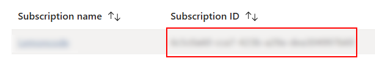

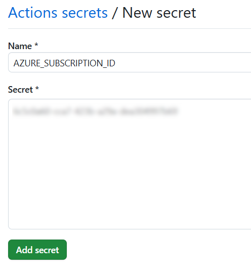

Now we can remove the publish profile from the secrets as well:

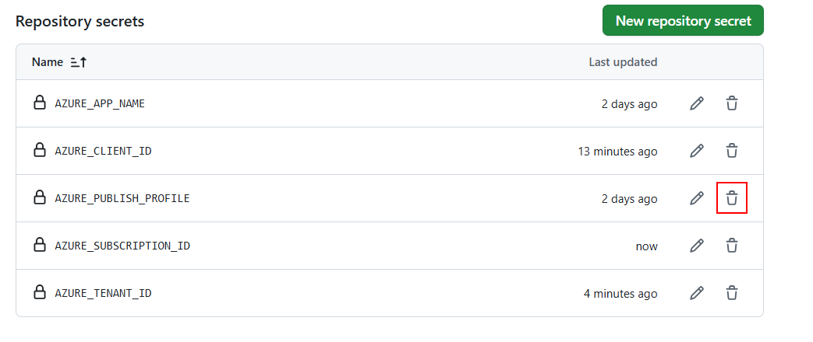

Upload changes:

```bash
git add .
git commit -m "update github workflow"
git push

```

# About Basefactor + Lemoncode

We are an innovating team of Javascript experts, passionate about turning your ideas into robust products.

[Basefactor, consultancy by Lemoncode](http://www.basefactor.com) provides consultancy and coaching services.

[Lemoncode](http://lemoncode.net/services/en/#en-home) provides training services.

For the LATAM/Spanish audience we are running an Online Front End Master degree, more info: http://lemoncode.net/master-frontend
