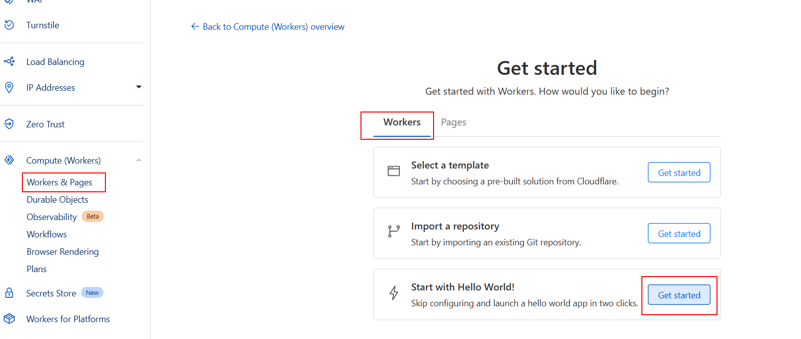
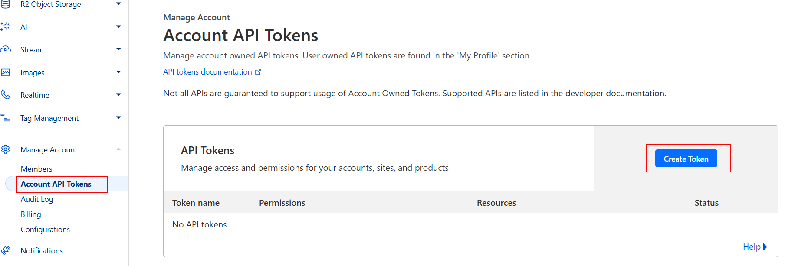
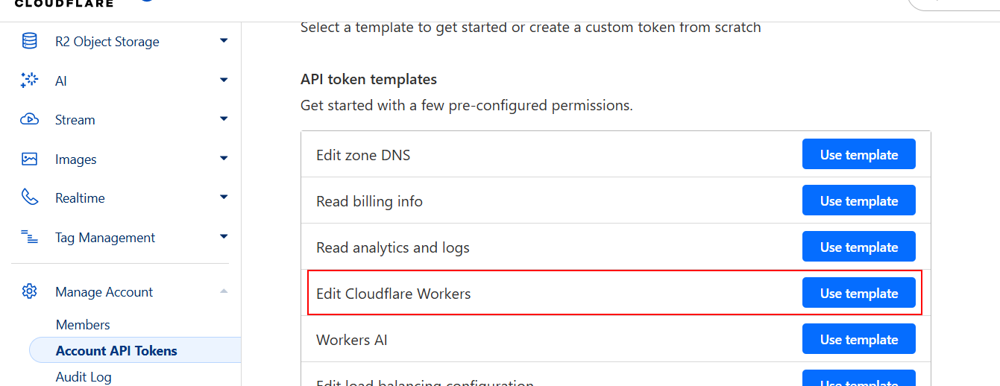

# 06 Cloudflare

In this example we are going to upload a front app to Cloudflare using a Cloudflare Worker.

We will start from `04-manual-render-deploy`.

# Steps to build it

`npm install` to install previous sample packages:

```bash
npm install
```

Create new repository and upload files:


```bash
git init
git remote add origin git@github.com...
git add .
git commit -m "initial commit"
git push -u origin main

```

Create a new _Worker_:



> Cloudflare recommends to use a Workers for new projects. See how Workers compares to Pages in [the compatibility matrix](https://developers.cloudflare.com/workers/static-assets/migration-guides/migrate-from-pages/#compatibility-matrix)







# About Basefactor + Lemoncode

We are an innovating team of Javascript experts, passionate about turning your ideas into robust products.

[Basefactor, consultancy by Lemoncode](http://www.basefactor.com) provides consultancy and coaching services.

[Lemoncode](http://lemoncode.net/services/en/#en-home) provides training services.

For the LATAM/Spanish audience we are running an Online Front End Master degree, more info: http://lemoncode.net/master-frontend
