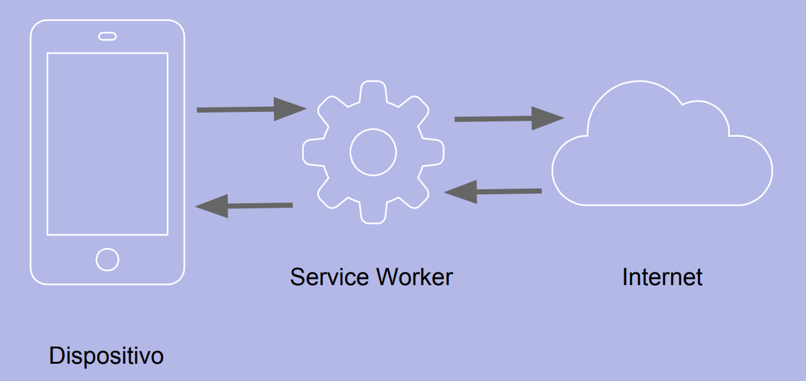

# Service Worker

## Qué son

Los service workers son **workers** dirigidos por **eventos**. Físicamente son archivos de javascript que pueden controlar la página en la que han sido **registrados** interceptado y modificando las peticiones y las respuestas.

Peculiaridades de los service workers:

- Se ejecutan en un contexto distinto (worker). Por lo tanto no tienen acceso al DOM, ni al localStorage...
- Se ejecutan en un hilo distinto al del javascript principal de la aplicación y son completamente asíncronos.
- Por seguridad, solamente funcionan sobre HTTPS para evitar ataques “man in the middle”.
- Algunos navegadores no permiten la ejecución de Service Workers en navegación privada.
- Funcionan con promesas.

https://developer.mozilla.org/es/docs/Web/API/Service_Worker_API

## Cómo funcionan

Los service workers interceptan TODAS las peticiones que realiza el navegador y pueden manipularlas a su antojo y emitir la respuesta original u otra respuesta distinta. 



Es por esto que su gran utilidad es que la web funcione incluso cuando no haya conexión a internet.

## Registro de un service worker

Un service worker debe ser registrado con javascript.

Es decir necesitamos que exista un javascript en el html que ejecute un código similar al siguiente:

```javascript
if ('serviceWorker' in navigator) {
  navigator.serviceWorker.register('/sw-test/sw.js', {scope: '/sw-test/'})
  .then(function(reg) {
    // registration worked
    console.log('Registration succeeded. Scope is ' + reg.scope);
  }).catch(function(error) {
    // registration failed
    console.log('Registration failed with ' + error);
  });
}
```

La url es relativa al origin, no relativa a la ubicación física del javascript en donde está el código de registro.

El scope es opcional. Indica qué parte de nuestra web estará bajo el control del Service Worker. 


## Ciclo de vida de un Service Worker

Una vez registrado, el service worker pasará por los siguientes estados:

- Installing
- Installed
- Activating
- Activated

Un Service Worker se descarga tan pronto como es registrado. Además, el navegador debe volver a descargarlo al menos cada 24 horas.

Si el fichero es descargado es nuevo, se instala.

Una vez instalado, se activa. Si había otro service worker activo, el nuevo debe esperar hasta que deje de haber páginas que utilicen el service worker antiguo. 

## Eventos

- install: se produce justo antes de que el SW termine de instalarse.
- activate: se produce justo antes de que el SW termine de activarse.
- fetch: se produce cada vez que el navegador realiza una petición.
- sync: se produce cuando se recupera la conexión
- push: se produce cuando se recibe una notificación push.
- notificationclick: se produce cuando se hace click en una notificación o en una acción de una notificación.
- notificationclose: se produce cuando el sistema o el usuario cierra la notificación.
- message: para intercambiar mensajes con el javascript principal.
- messageerror: se produce cuando un mensaje no puede ser des-serializado.
- canmakepayment
- paymentrequest

https://w3c.github.io/ServiceWorker/#execution-context-events

## Desisntalar un service worker

Para desinstalar un SW, hay que llamar al método **unregister()** del objeto *registration* correspondiente a nuestro SW. Existe un método **getRegistrations()** que nos devuelve todos los registros existentes.

```javascript
if ('serviceWorker' in navigator) {
  navigator.serviceWorker.getRegistrations()
  .then(function(registrations) {
    for(let registration of registrations) {
      registration.unregister()
    }
  })
}
```


### Intercambiar mensajes con los clientes

```javascript
self.addEventListener('message', function(event){
    console.log("SW Received Message: " + event.data);
});
```

```javascript
navigator.serviceWorker.controller.postMessage("Client 1 says '"+msg+"'");
```

## Enlaces de interés

- Documentación: https://w3c.github.io/ServiceWorker/
- Ciclo de vida: https://developers.google.com/web/fundamentals/primers/service-workers/lifecycle
- Ejemplos: 
  - https://github.com/GoogleChrome/samples/tree/gh-pages/service-worker
  - https://serviceworke.rs/