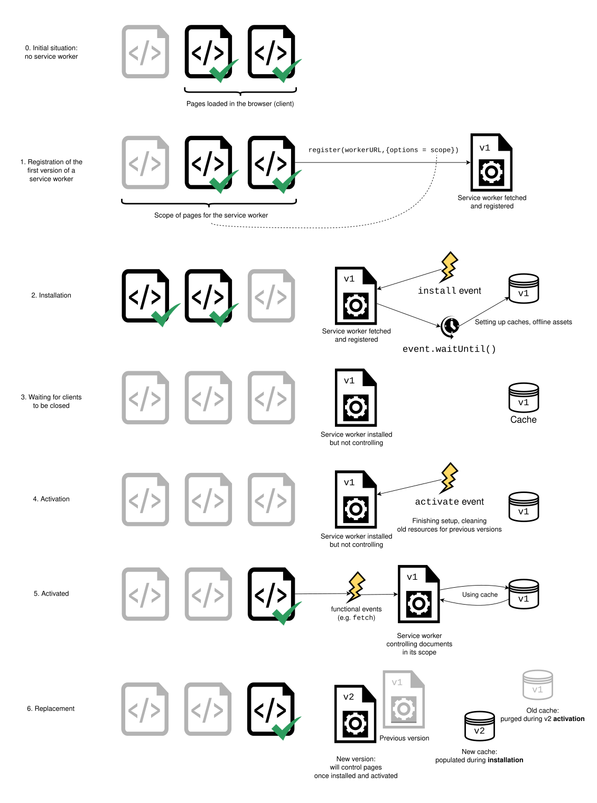

# Using Service Workers

## The premise of service workers

One overriding problem that web users have suffered with for years is loss of connectivity. The best web app in the world will provide a terrible user experience if you can't download it. There have been various attempts to create technologies to solve this problem, and some of the issues have been solved. But the overriding problem is that there wasn't a good overall control mechanism for asset caching and custom network requests.

Service workers fix these issues. Using a service worker you can set an app up to use cached assets first, thus providing a default experience even when offline, before then getting more data from the network (commonly known as "offline first"). This is already available with native apps, which is one of the main reasons native apps are often chosen over web apps.

A service worker functions like a proxy server, allowing you to modify requests and responses replacing them with items from its own cache.

## Setting up to play with service workers

- Enabled by default by all modern browsers
- Running code with service workers implies use of HTTPS
- To facilitate local development, `localhost` is considered secure origin as well

## Basic architecture

The following steps are generally observed for basic setup:

1. The service worker code is fetched and then registered using [serviceWorkerContainer.register()](https://developer.mozilla.org/en-US/docs/Web/API/ServiceWorkerContainer/register). If successful, the service worker is executed in a [ServiceWorkerGlobalScope](https://developer.mozilla.org/en-US/docs/Web/API/ServiceWorkerGlobalScope); this is basically a special kind of worker context, running off the main script execution thread, with no DOM access. The service worker is now ready to process events.

2. Installation takes place. An `install` event is always the first one sent to a service worker (this can be used to start the process of populating an IndexedDB, and caching site assets). During this step, the application is preparing to make everything available for use offline.

3. When the `install` handler completes, the service worker is considered installed. At this point a previous version of the service worker may be active and controlling open pages. Because we don't want two different versions of the same service worker running at the same time, the new version is not yet active.

4. Once all pages controlled by the old version of the service worker have closed, it's safe to retire the old version, and the newly installed service worker receives an activate event. The primary use of activate is to clean up resources used in previous versions of the service worker. The new service worker can call [skipWaiting()](https://developer.mozilla.org/en-US/docs/Web/API/ServiceWorkerGlobalScope/skipWaiting) to ask to be activated immediately without waiting for open pages to be closed. The new service worker will then receive activate immediately, and will take over any open pages.

5. After activation, the service worker will now control pages, but only those that were opened after the `register()` is successful. In other words, documents will have to be reloaded to actually be controlled, because a document starts life with or without a service worker and maintains that for its lifetime. To override this default behavior and adopt open pages, a service worker can call [clients.claim()](https://developer.mozilla.org/en-US/docs/Web/API/Clients/claim).

6. Whenever a new version of a service worker is fetched, this cycle happens again and the remains of the previous version are cleaned during the new version's activation.

    

### Summary of the available service worker events:

- [install](https://developer.mozilla.org/en-US/docs/Web/API/ServiceWorkerGlobalScope/install_event)
- [activate](https://developer.mozilla.org/en-US/docs/Web/API/ServiceWorkerGlobalScope/activate_event)
- [message](https://developer.mozilla.org/en-US/docs/Web/API/ServiceWorkerGlobalScope/message_event)
- Functional events:
  - [fetch](https://developer.mozilla.org/en-US/docs/Web/API/ServiceWorkerGlobalScope/fetch_event)
  - [sync](https://developer.mozilla.org/en-US/docs/Web/API/ServiceWorkerGlobalScope/sync_event)
  - [push](https://developer.mozilla.org/en-US/docs/Web/API/ServiceWorkerGlobalScope/push_event)

## Demo

[Using service workers demo](../02-using-service-workers-demo/)

