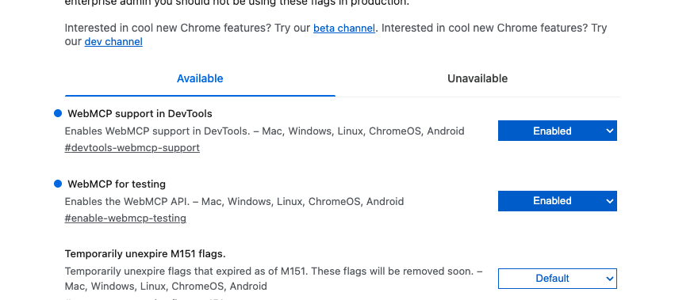

# Set Up


## Dev Tools

On `chrome://flags/` enable the following features:



## Solution

```bash
nvm use 26
```

```bash
mkdir solution && cd solution
```


```bash
npm init -y
```

```bash
npm i serve
```

Update `package.json`

```diff
# ....
  "scripts": {
+   "serve": "serve solution -p 8085",
    "test": "echo \"Error: no test specified\" && exit 1"
  },
# ....
```

Create `solution/app.js`, by now empty

Create `solution/index.html`

```html
<!doctype html>
<html lang="en">
  <head>
    <meta charset="UTF-8" />
    <meta name="viewport" content="width=device-width, initial-scale=1.0" />
    <title>Document</title>
    <style>
      body {
        font-family: Arial, Helvetica, sans-serif;
      }
    </style>
  </head>
  <body>
    <h1>Hell WebMCP</h1>
    <script type="module" src="app.js"></script>
  </body>
</html>

```

## Install Pollyfill

```bash
npm install @mcp-b/webmcp-polyfill
```

Update `app.js`

```js
import "./node_modules/@mcp-b/webmcp-polyfill/dist/index.js";

const mcp = navigator.modelContext || document.modelContext;
console.log("WebMCP ready:", mcp);

```

```bash
npm run serve
```

Check on console that the `mcp` is populated.