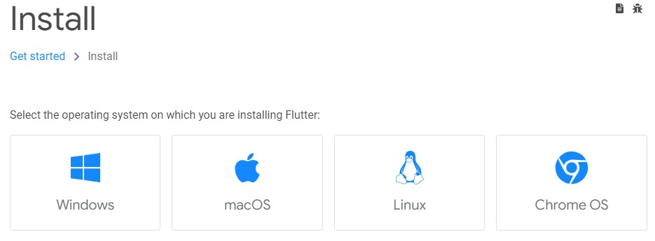
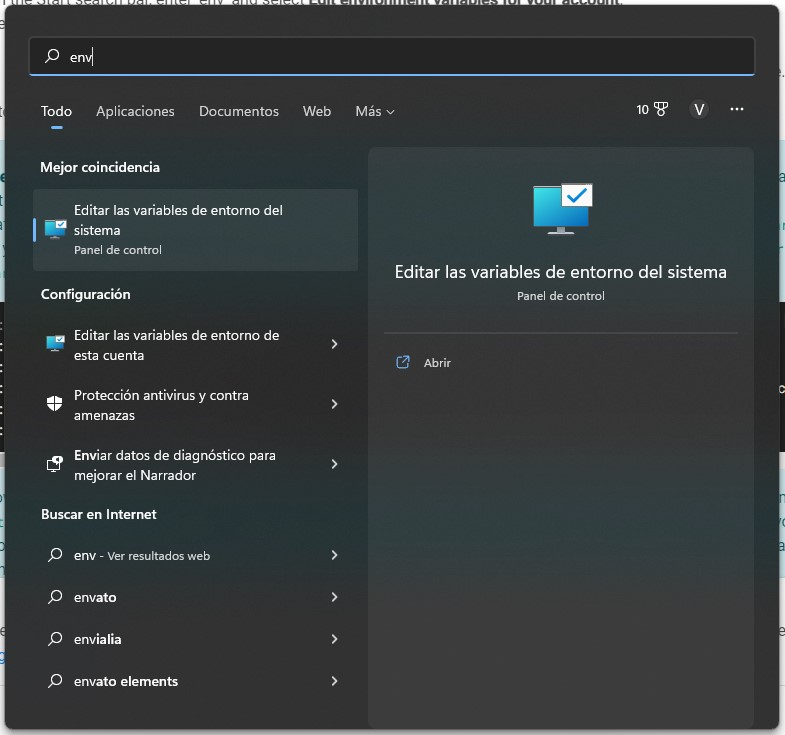
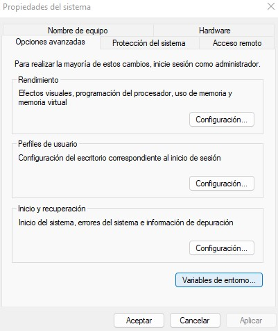
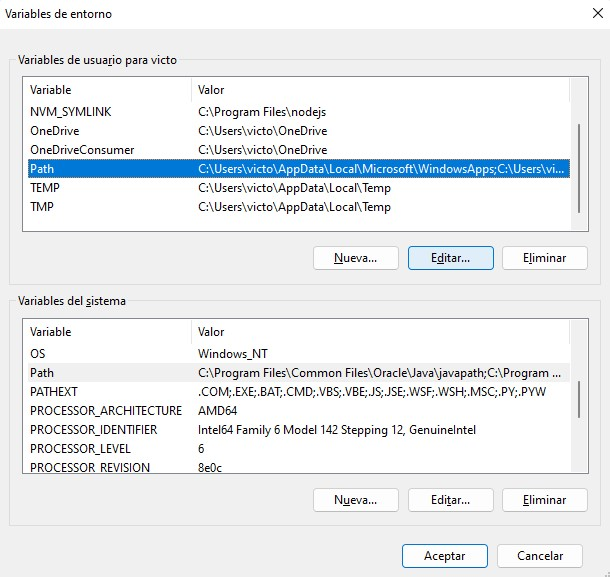
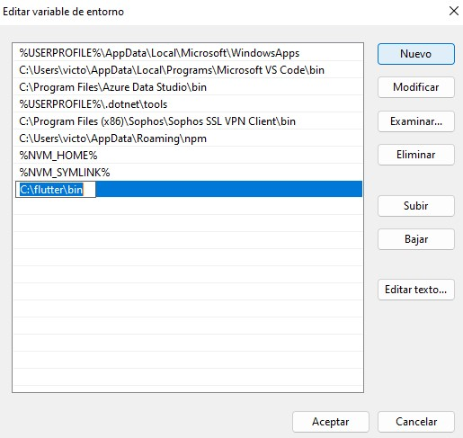
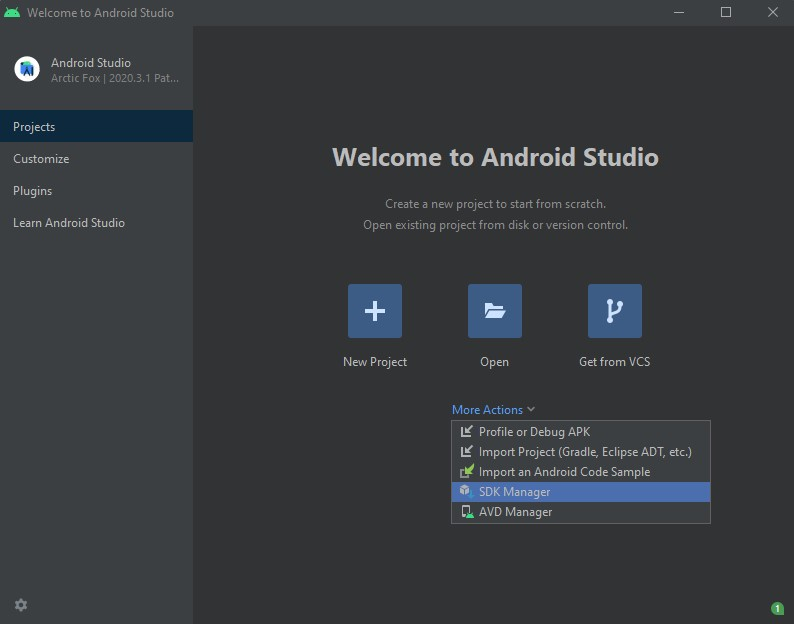
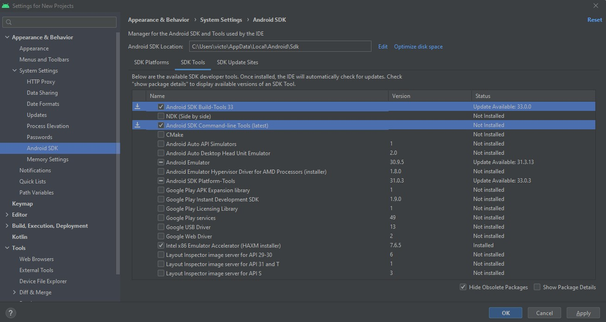
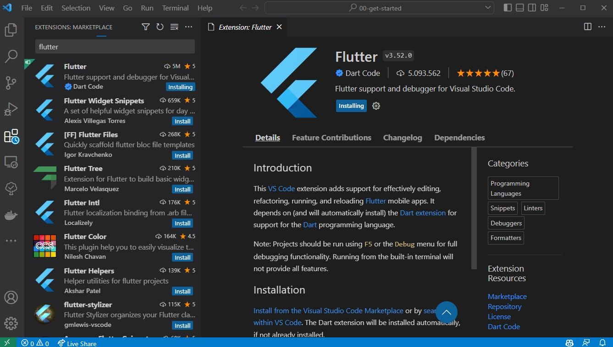
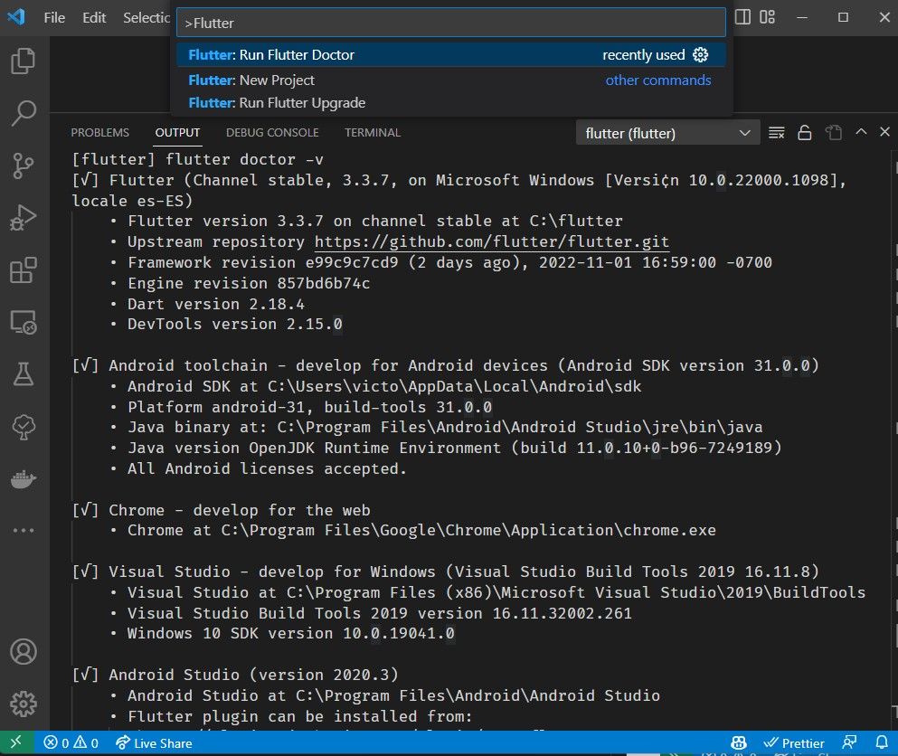

# Introducción a Flutter

Flutter es un framework de desarrollo de aplicaciones móviles de código abierto desarrollado por Google. Es utilizado para desarrollar aplicaciones para Android y iOS, así como aplicaciones de escritorio y web desde un único código base.

## Instalación

Primero vamos a descargar e instalar Flutter en nuestro equipo: https://docs.flutter.dev/get-started/install



### Instalación en Windows

Para instalar Flutter en Windows, debemos descargar el archivo zip desde la página oficial de Flutter. Una vez descargado, descomprimimos el archivo en la carpeta que queramos (por ejemplo `C:\flutter`).

> No descomprimirlo en una carpeta con espacios, caracteres extraños o con permisos especiales (como `Program files`), puede dar problemas.

### Agregar Flutter al PATH

Para poder ejecutar los comandos de Flutter desde cualquier lugar, debemos agregarlo al PATH de nuestro sistema. Para ello, abrimos el menú de inicio y desde la página de búsqueda escribimos `env` y seleccionamos `Editar las variables de entorno del sistema`.



En la ventana que se abre, seleccionamos la opción `Variables de entorno...`.



En la ventana que se abre, bajo las variables de Usuario, seleccionamos la variable `Path` y pulsamos el botón `Editar`.



En la ventana que se abre, pulsamos el botón `Nuevo` y escribimos la ruta de la carpeta `bin` donde hemos descomprimido Flutter. En nuestro caso, `C:\flutter\bin`.



Una vez hecho esto, podemos ejecutar el siguiente comando para comprobar que todo está bien:

```bash
where flutter dart
```

Y debería aparecer algo como esto:

```bash
C:\flutter\bin\flutter
C:\flutter\bin\flutter.bat
C:\flutter\bin\dart
C:\flutter\bin\dart.bat
```

### Android Setup

Para poder ejecutar aplicaciones de Flutter en un dispositivo Android, debemos instalar el SDK de Android. Para ello, instalamos Android Studio desde la página oficial: https://developer.android.com/studio

Una vez instalado, abrimos Android Studio y seleccionamos la opción `More Actions` y luego `SDK Manager`.



En la ventana que se abre, seleccionamos la opción `SDK Tools` y marcamos las siguientes opciones:

- Android SDK Build-Tools
- Android SDK Command-line Tools



Y por último aceptamos la licencia de Android con el siguiente comando desde un terminal:

```bash
flutter doctor --android-licenses
```

### Comprobar instalación

Para comprobar que todo está bien instalado, ejecutamos el siguiente comando desde un terminal:

```bash
flutter doctor
```

Y debería aparecer algo como esto:

```bash
[√] Flutter (Channel stable, 3.3.7, on Microsoft Windows [Versi¢n 10.0.22000.1098], locale es-ES)
[√] Android toolchain - develop for Android devices (Android SDK version 31.0.0)
[√] Chrome - develop for the web
[√] Visual Studio - develop for Windows (Visual Studio Build Tools 2019 16.11.8)
[√] Android Studio (version 2020.3)
[√] VS Code (version 1.73.0)
[√] Connected device (3 available)
[√] HTTP Host Availability

• No issues found!
```

Si aparece algún issue, podemos solucionarlo siguiendo las instrucciones que nos aparecen.

## Setup VS Code

Para preparar VS Code para trabajar con Flutter, instalaremos la extensión `Flutter` (incluirá la extensión de `Dart`):



Para validar que todo está bien instalado, desde VS Code pulsamos `F1` (o `Ctrl + Shift + P`) y escribimos y seleccionamos `Flutter: Run Flutter Doctor`:



Deberíamos comprobar que no tenemos ninguna issue :)

# ¿Te apuntas a nuestro máster?

Si te ha gustado este ejemplo y tienes ganas de aprender Front End guiado por un grupo de profesionales ¿Por qué no te apuntas a nuestro [Máster Front End Online Lemoncode](https://lemoncode.net/master-frontend#inicio-banner)? Tenemos tanto edición de convocatoria con clases en vivo, como edición continua con mentorización, para que puedas ir a tu ritmo y aprender mucho.

Si lo que te gusta es el mundo del _backend_ también puedes apuntante a nuestro [Bootcamp backend online Lemoncode](https://lemoncode.net/bootcamp-backend#bootcamp-backend/inicio).

Y si tienes ganas de meterte una zambullida en el mundo _devops_ apuntate nuestro [Bootcamp devops online Lemoncode](https://lemoncode.net/bootcamp-devops#bootcamp-devops/inicio).
