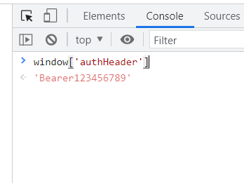
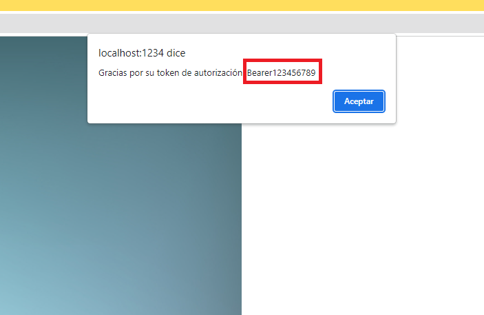

# No framework - Ejercicio 02 - Sustraer header

En este ejemplo vamos a tener una primera pantalla donde vamos a logarnos, una vez logados vamos a ver que en nuestro objeto global _window_ tenemos una autenticación de cabecera. Veremos si podemos inyectar un script y ejecutar un código malicioso para poder sustraer la autentificación de cabecera.

## Instalación

Vamos a ejecutar desde la línea de comandos `npm install` para instalar las dependencias que tenemos en nuestro _package.json_.

```bash
npm install
```

Una vez instaladas nuestras dependencias vamos a hacer `npm start` para arrancar nuestra aplicación.

```bash
npm start
```

Abrimos el navegador y vamos a la url:

[**http://localhost:1234**](http://localhost:1234)

Tenemos un servidor mock corriendo en localhost 3000.

## Pasos

Vamos primero a revisar el código que estamos usando cuando validamos nuestras
credenciales y obtenemos el token de autorización, en nuestro caso tenemos
el siguiente método:

> ESTE CODIGO ES DE REFERENCIA PARA ENCONTRAR EL FICHERO, NO TECLEARLO

_./frontend/src/index.ts_:

```ts
// Aquí se hace el login
form.addEventListener("submit", (event) => {
```

En concreto donde almacenamos el token en una variable global _authHeader_.

```ts
  })
    .then((resp) => {
      // Aquí es donde se obtiene el token de autorización
      // y lo almacenamos en la variable global window["authHeader"]
      window["authHeader"] = resp.headers.get("Authorization");
```

Nos logamos en la aplicación usando como usuario _admin_ y contraseña _test_.

Una vez logados vamos a inspeccionar la consola e insertar en siguiente comando:

```javascript
window["authHeader"];
```

Y obtenemos el _token_ que hemos enviado a través de las cabeceras.



Estamos guardando en una variable global _authHeader_, esto sería una mala práctica pero nos puede puede pasar en un caso real.

_./frontend/src/index.ts_:


Una vez iniciada la sesión hemos recibido nuestro token para las cabeceras. Y ahora vamos a ver cómo sustraerlas.

Vamos a insertar este _anchor_ en el _textarea_ y enviamos la petición al servidor.

```html
<a onClick="alert('Gracias por su token de autorización: '+window.authHeader)">
  Click aquí para ver tu biografía
</a>
```

Generará un párrafo debajo del _textarea_ y haremos clic en él para ver nuestra biografía introducida.

```text
Click aquí para ver tu biografía
```


Y si hacemos clic en él recibiremos una alerta con el nuestro _token_:



Otra forma de obtener el token sería introducir en el _textarea_ una imagen como hicimos en el ejemplo anterior. Nos aparecería también el _alert_ con nuestro _token_.

```html

```
