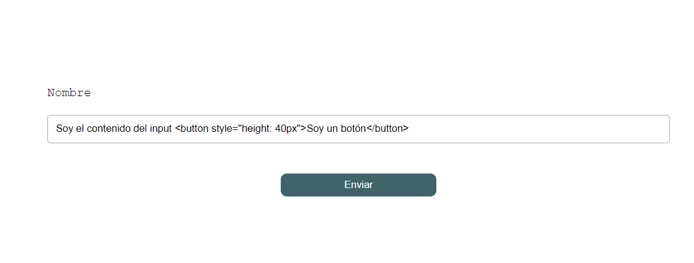
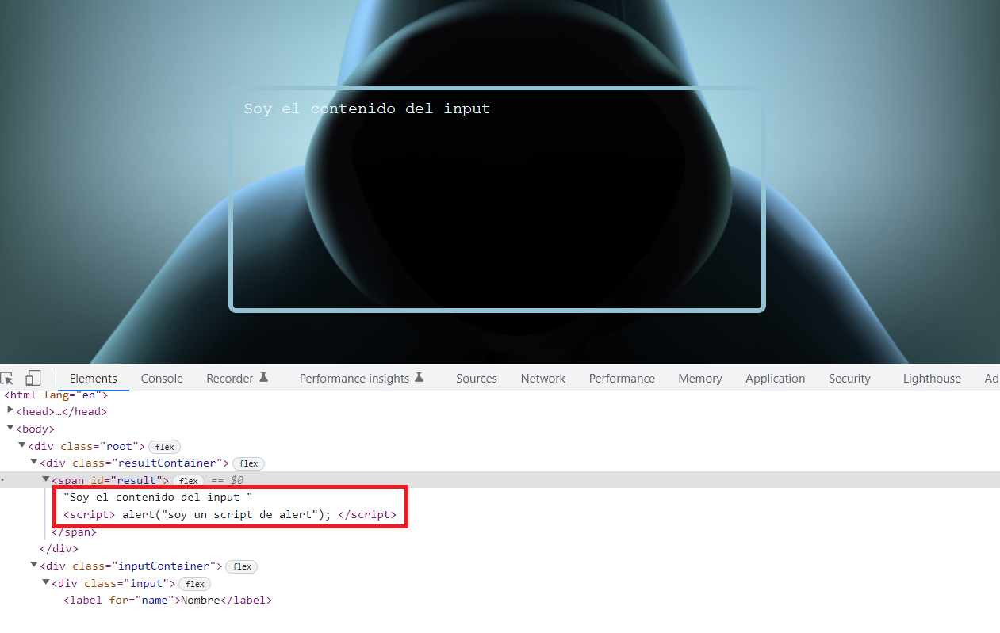
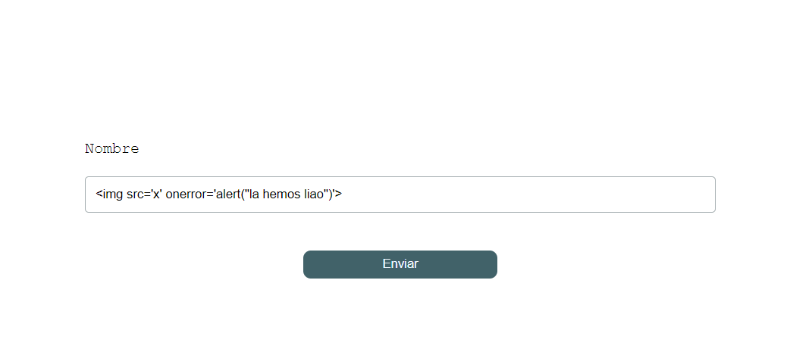
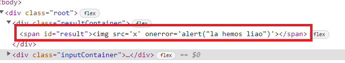

# No framework - ejercicio 01

En este ejemplo vamos a tener un formulario y un texto, este texto lo vamos a mostrar en una etiqueta _span_. Vamos a ver si en ese texto podemos inyectar un script y ejecutar un código malicioso.

Aunque no debería de ejecutarse una etiqueta _script_ insertada dentro de un innerHTML, vamos a ver que existen diferentes formas que nos permiten ejecutar código malicioso.

Para solucionar esto _mdn_ nos recomienda usar:

- **Element.SetHTML()**: para hacer un sanitize del texto antes de insertarlo en el DOM. Este método está todavía en experimental.
- **Node.textContent**: no lo analiza cómo si fuera HTML, y lo inserta como texto plano.

[Más información](https://developer.mozilla.org/en-US/docs/Web/API/Element/innerHTML)

# Manos a la obra

> ## Instalación:

Vamos a ejecutar desde la línea de comandos **`npm install`** para instalar las dependencias que tenemos en nuestro _package.json_.

```javascript
npm install
```

Una vez instaladas nuestras dependencias vamos a hacer **`npm start`** para arrancar nuestra aplicación.

```javascript
npm start
```

Abrimos el navegador y vamos a la url:

[**http://localhost:1234**](http://localhost:1234)

> ## Pasos

Vamos a comenzar añadiendo el siguiente código **html** dentro del input de nuestro formulario y enviamos.

```html
Soy el contenido del input <button style="height: 40px">Soy un botón</button>
```



Como podemos observar la salida del **input** nos muestra el texto pero también un botón. Esto es porque el **DOM** ha podido leer esta etiqueta. Si inspeccionamos el código en el navegador podemos ver que así es:


Esto nos puede llevar a pensar: Sí se ha podido pintar un botón, ¿Por qué no ejecutar un **script** utilizando sus etiquetas?... probemos el siguiente ejemplo:

```html
Soy el contenido del input
<script>
  alert("soy un script de alert");
</script>
```


Upss!! ¿Y mi alert?...



Podemos ver que se ha incluido el **script** pero no se ha ejecutado el **alert**.

Quizá sea demasiado obvio incluir una etiqueta `<script>` y el navegador no lo ejecuta por seguridad.

Lo que sucede es que **html5** ya controla este tipo de inyecciones de código en los **input** y no permite ejecutar su contenido por seguridad.

Una de las formas para saltarnos esta restricción es inyectar nuestro código por ejemplo en la función `onerror` de la etiqueta ``, vamos a probarlo.

```html

```



Al enviar vemos que la imagen sale errónea pero hemos ejecutado código _javascript_.


Esto es un ejemplo básico, en las siguientes demos veremos cómo podemos sustraer cookies, headers y varios ejemplos más.

> ## Cómo solucionarlo

Para solucionar esto, _mdn_ nos recomienda que utilicemos _textContent_.

Vamos a nuestro _index.ts_ y cambiamos _innerHTML_ por _textContent_.

_src/index.ts_

```diff
document.getElementById("submit").addEventListener("click", function (e) {
	const input = document.getElementById("name") as HTMLInputElement | null;
	const contenido = input?.value;

-   document.getElementById("result").innerHTML = contenido;
+	document.getElementById("result").textContent = contenido;
});
```

Y si ahora introducimos en nuestro _input_ y enviamos:

```

```

Nos trata a la etiqueta _img_ como si fuera un texto plano y nos lo inserta dentro del _result_.


Si inspeccionamos el código en nuestro navegador este sería el resultado:



Si no queremos perder la capacidad de poner HTML, podemos intentar usar
un "purifier", ojo que aquí se pueden quedar puertas abiertas.

```bash
npm install dompurify --save
```

```bash
npm install @types/dompurify --save-dev
```

```diff
import * as DOMPurify from "dompurify";
.....
document.getElementById("submit").addEventListener("click", function (e) {
	const input = document.getElementById("name") as HTMLInputElement | null;
	const contenido = input?.value;

-	document.getElementById("result").textContent = contenido;
+  const contenidoCurado = DOMPurify.sanitize(contenido);
+  document.getElementById("result").innerHTML = contenidoCurado;
});
```

- Arrancamos

```bash
npm start
```

- Si volvemos a intentar insertar el código malicioso:

```

```

Si nos fijamos aparece el IMG pero no el script.

Así podemos insertar un botón

```html
Soy el contenido del input <button style="height: 40px">Soy un botón</button>
```

# Referencias

[En este enlace puedes encontrar varios ejemplos de código con inyecciones **XSS**]("https://cheatsheetseries.owasp.org/cheatsheets/XSS_Filter_Evasion_Cheat_Sheet.html")
