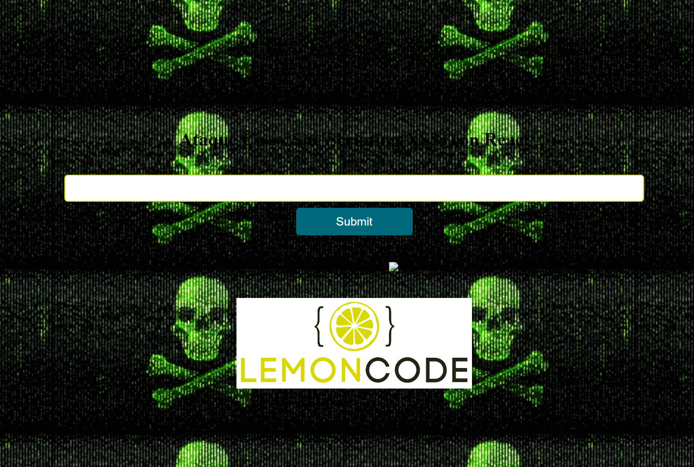
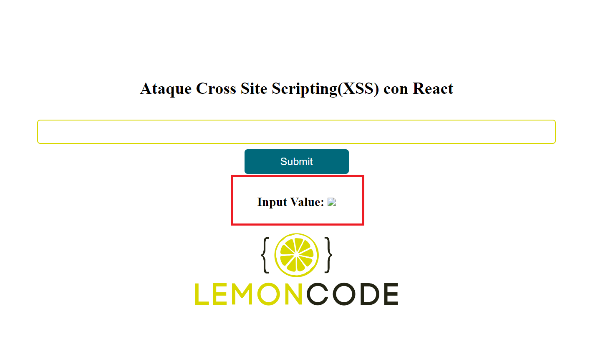

# XSS con React - Ejercicio 1

Si utilizamos un _framework_ tenemos protección adicional contra ataques xss, pero ¿es esto siempre así?. En una aplicación es muy común que te pidan añadir código HTML, en _JavaScript_ utilizamos _innerHTML_, pero _React_ nos ofrece su alternativa  [*dangerouslySetInnerHTML*](https://reactjs.org/docs/dom-elements.html), pero esto puede llegar a ser muy peligroso para la seguridad de nuestra aplicación. Para evitar esto se recomienda el uso de *Markdown*, que en principio no acepta _HTML_ aunque se podría configurar para que sí lo acepte. 

En el siguiente ejemplo veremos el problema de usar _dangerouslySetInnerHTML_ y utilizaremos una librería externa, llamada DomPurify, para arreglar este agujero de seguridad.

# Manos a la obra

>## Instalación:

Vamos a ejecutar desde la línea de comandos **`npm install`** para instalar las dependencias que tenemos en nuestro _package.json_.

```javascript
npm install
```

Una vez instaladas nuestras dependencias vamos a hacer **`npm start`** para arrancar nuestra aplicación.

```javascript
npm start
```

Abrimos el navegador y vamos a la url: 

[**http://localhost:1234**](http://localhost:1234)

>## Pasos

Tenemos un _input_  donde vamos a introducir un texto, el cuál lo mostraremos en pantalla debajo del formulario, justo después de hacer _submit_. 

Para esto hemos creado un estado donde almacenaremos el valor del _input_ y luego lo pintaremos en un _h2_ con la ayuda de _*dangerouslySetInnerHTML*_.

*./src/app.tsx*

```tsx
import React from "react";
import * as classes from "./app.styles";
import logo from "./content/logo_2.png";

export const App: React.FC = () => {
  const [input, setInput] = React.useState("");
  const [output, setOutput] = React.useState("");
.....
  <h2 dangerouslySetInnerHTML={{ __html: output }}></h2>
.....
```

Si probamos como hicimos en el ejemplo anterior e introducimos una etiqueta *script* y hacemos la petición:

```javascript
Soy el contenido del input
<script>
  alert("soy un script de alert");
</script>
```

Si inspeccionamos el código vemos que nos pinta el texto y nos ignora el _script_ sin pintarlo por pantalla, es decir, lo está ignorando por seguridad.


Pero podemos saltarnos esta seguridad haciendo el uso del evento *onerror* la etiqueta *img* como hicimos en el ejemplo anterior.

Vamos a hacer un primer ejemplo introduciendo un *alert* como ya hicimos:

```html

```

Y nos mostaría el siguiente resultado:


Incluso otro ejemplo sería modificar el _background_:

```html

```

Y veríamos nuestro fondo cambiado:




>## Cómo solucionarlo

Para solucionar esta vulnerabilidad podemos utilizar una librería de terceros llamada [_**DomPurify**_](https://www.npmjs.com/package/dompurify?activeTab=readme) que nos eliminará todo el _HTML_ peligroso y nos devolverá un _HTML_ limpio.

Vamos a empezar por su instalación, abrimos nuestra terminal y lo instalamos:

```
npm install dompurify --save
```

Ahora vamos dentro de _./src/app.tsx_ y vamos a refactorizar nuestro código y hacer uso de esta libería.

```diff
import React from "react";
+ import DOMPurify from 'dompurify';
import * as classes from "./app.styles";
import logo from "./content/logo_2.png";

export const App: React.FC = () => {
  const [input, setInput] = React.useState("");
  const [output, setOutput] = React.useState("");
+ const sanitizer = DOMPurify.sanitize;
.....

-           <h2 dangerouslySetInnerHTML={{ __html: output }}></h2> 
+    		<h2 dangerouslySetInnerHTML={{ __html: sanitizer(output) }}></h2>
      
    </div>
  );
};
```

Si volvemos a introducir el código malicioso por el input:

```html

```

Vemos que ya no modifica el _background_ de nuestra aplicación.


