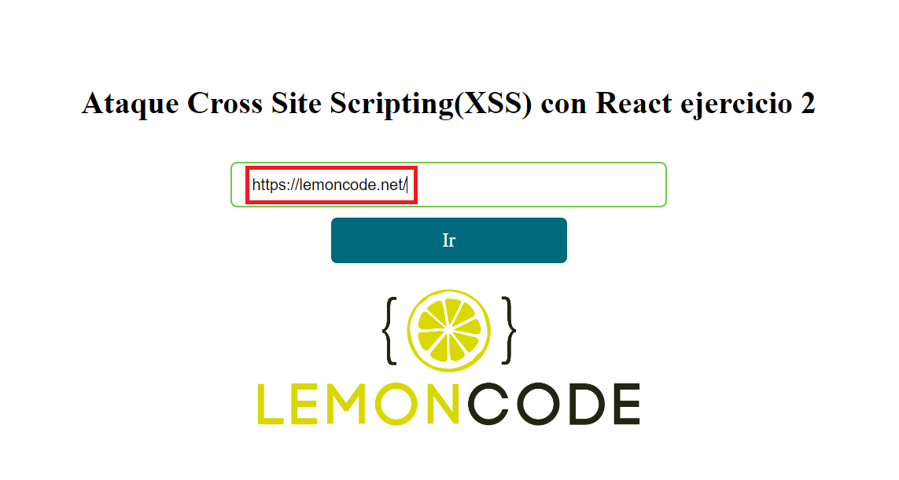
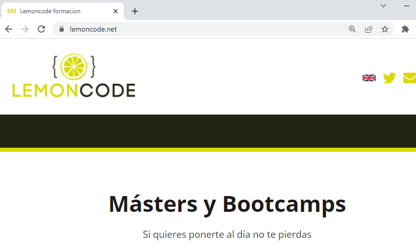
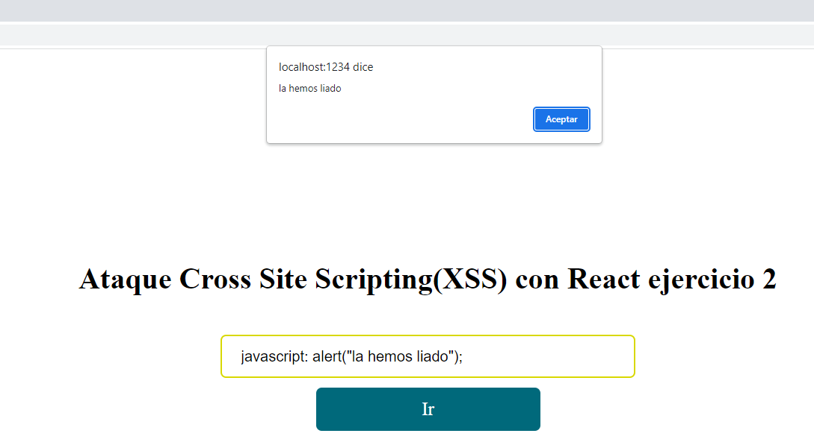
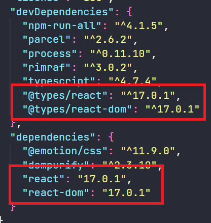

# XSS con React - Ejercicio 2

En este ejemplo vamos a ver cómo se comporta React ante un ataque XSS en el que se inyecta código JavaScript en una etiqueta anchor.

Para ello vamos a tener un _input_ en el que vamos a poder escribir la URL a la que queremos navegar. Cuando pulsemos el botón de _Ir_ se nos navegará a la URL que hayamos escrito.

# Manos a la obra

> ## Instalación:

Vamos a ejecutar desde la línea de comandos **`npm install`** para instalar las dependencias que tenemos en nuestro _package.json_.

```javascript
npm install
```

Una vez instaladas nuestras dependencias vamos a hacer **`npm start`** para arrancar nuestra aplicación.

```javascript
npm start
```

Abrimos el navegador y vamos a la url:

[**http://localhost:1234**](http://localhost:1234)

> ## Pasos

Tenemos un _input_ donde vamos a introducir una dirección web. Cuando pulsemos el botón de _Ir_ nos navegará a la URL que hayamos escrito.

_./src/app.tsx_

```javascript
......
 <input
      value={enlace}
      onChange={(e) => setEnlace(e.target.value)}
      className={classes.input}
    />

    <a href={enlace} className={classes.button}>
      Ir
    </a>
......
```

Vamos a empezar probando a la URL de lemoncode:

```bash
https://lemoncode.net
```



Vemos que nos navega correctamente a la página de lemoncode.



Ahora vamos a probar a introducir una URL maliciosa:

```javascript
javascript: alert("la hemos liado");
```

Vemos que nos muestra un alert con el mensaje que hemos escrito.



Si ahora vemos nuestro archivo _package.json_



Vemos que tenemos _react_ y _react-dom_ en la versión 17.0.1., podemos pensar que esto es un problema de la versión de _react_ y que si actualizamos a la última versión esto ya no nos va a pasar.

Vamos a desinstalar _react_ y _react-dom_ y a instalar la última versión. Y hacemos lo mismo con los _types_.

Empezamos borrando la carpeta de _node_modules_ y desinstalamos _react_ y _react-dom_:

```bash
npm uninstall react react-dom --save
```

Hacemos lo mismo con los _types_:

```bash
npm uninstall @types/react @types/react-dom --save-dev
```

Borramos el _package-lock.json_ e instalamos la última versión estable de _react_ y _react-dom_:

```bash   
npm install react react-dom --save
```

Y hacemos lo mismo con los _types_:

```bash
npm install @types/react @types/react-dom --save-dev
```

Ahora arrancamos nuestra aplicación:

```bash
npm start
```

Y probamos a introducir la URL maliciosa:

```
javascript: alert("la hemos liado");
```
Y vemos que nos sigue mostrando el alert. Así que con la versión estable de _React_ nos sigue ocurriendo lo mismo. Podemos inyectar código malicioso en una etiqueta _anchor_.


